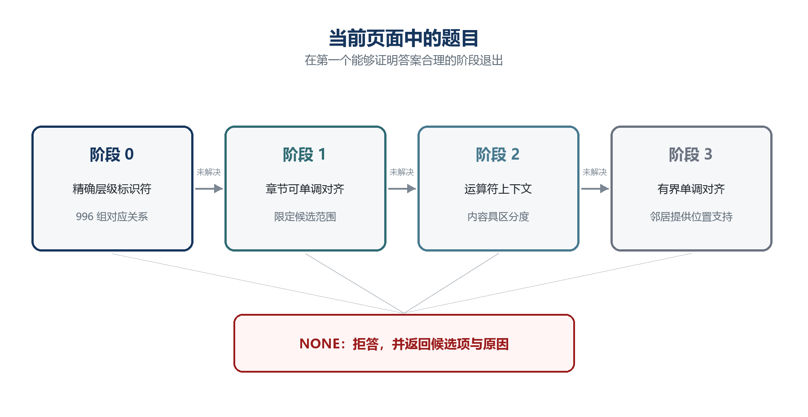
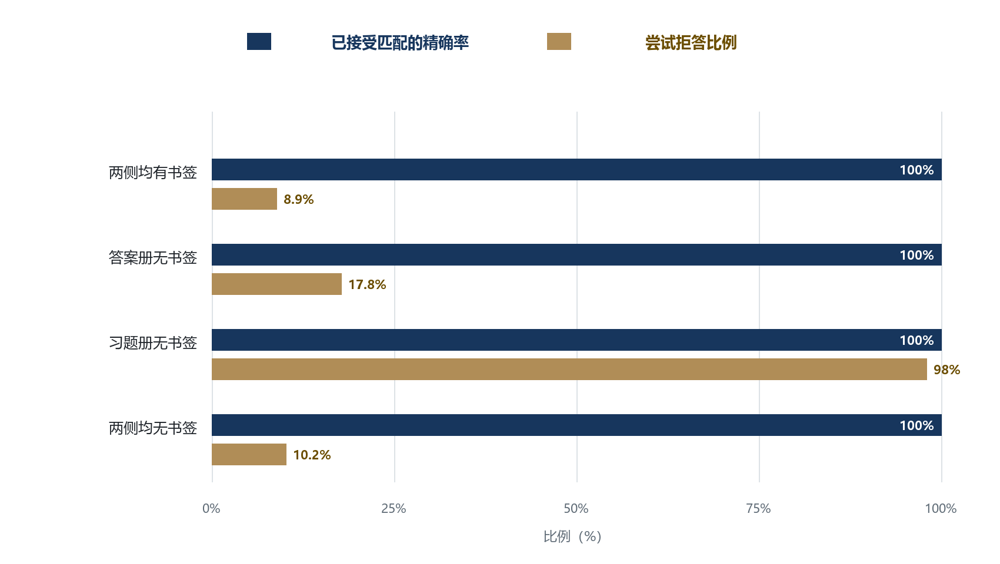
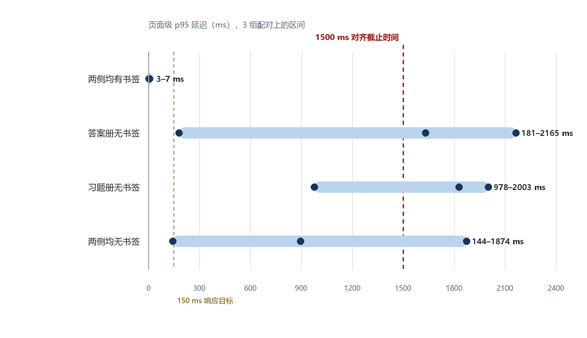
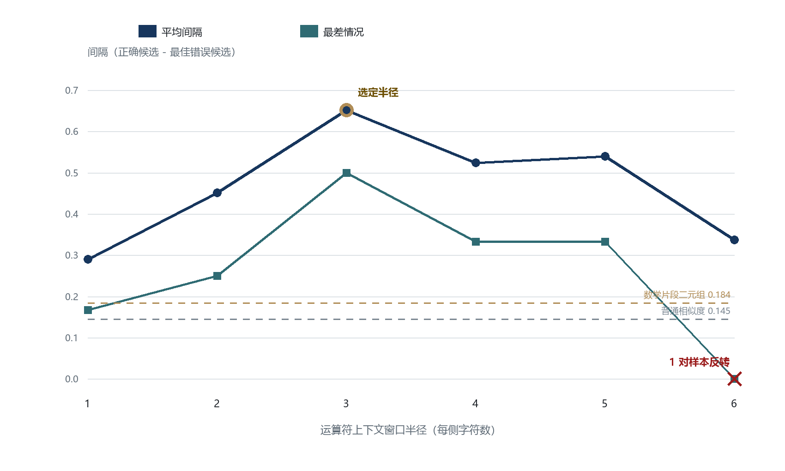

# Find-Engine：面向成对数学 PDF 的确定性题目-答案对齐

**技术研究报告**

*版本 2.1｜2026 年 8 月 30 日*

---

## 摘要

本文介绍 Find-Engine：一个仅依赖两份 PDF，即可将数学教材中的习题与物理上独立存放的答案册中的解答进行对齐的确定性系统。该问题可视为单调序列对齐的一个受约束实例，但它与双语文本对齐存在两项会改变系统设计的关键差异：其一，文档能够提供普通散文所不具备的结构锚点，如层级式题目标识符与书签树；其二，错误对齐的代价具有不对称性——向学生展示一道题的错误解答，比不展示任何解答更糟。

系统首先决定自己是否愿意处理这两份文档，然后才决定题目如何匹配。文档角色、配对身份与文本层可用性由系统**自行推导**，而非由调用方声明；随后是一个按成本递增排列的四阶段级联，查询一旦在某个阶段得到解决便立即停止。语料由 8 册正式出版的考研数学资料构成，形成 3 组两侧均有题目级书签的完整配对，以及 1 组习题册为扫描件的配对。3 组完整配对包含 996 组题目-答案对应关系：默认严格公式策略自动解决 804 组（470/508、159/271、175/217），可切换的校准策略解决 996/996；两种策略均未观察到错误答案。两侧书签完整时，全书页面级延迟第 95 百分位数为 3–7 ms。在由不该配在一起的文档构成的全部 60 种组合上——错年份、错科目、答案对答案、习题对习题、正反颠倒——系统不产生任何自动答案。作为对照，早期把验证事实当作参数接收的设计在同样 60 种组合中有 52 种给出了自信的答案。

本文报告一项架构性发现与五项负面结果。该发现是：看似精确率与召回率之间取舍的现象，大部分其实是缺陷——三处故障各自同时损害两个指标，修复它们提升了召回率而未触动精确率。五项负面结果分别是：一种在设计上看似安全的位置先验，却在非平行文档上把 120 道题中的 120 道全部错配；一次看似确信的“字体损坏”诊断，真实原因是 PDF 阅读器缺少配置；一项近乎循环、因而根本不可能失败的正确性度量；一条要求 N 项结构证据全部成立的规则，在含噪输入下以 N 次方衰减，从而按题目复杂度而非按错误率拒答；以及三次对有效配对的误拒，均可追溯到同一个错误——把针对某种文档表示标定的阈值套用到另一种表示上。保留这些失败，是因为导致失败的推理过程可被复用，而事后的修正并不显而易见。

**关键词：** 确定性对齐；PDF 文档结构；题目-答案匹配；数学相似度；拒答机制；单调序列对齐；准入门控

---

## 1 引言

### 1.1 问题定义

设 *E* 为习题册，*A* 为答案册，二者以相互独立的 PDF 文档出版。*E* 包含按顺序排列的编号题目，*A* 包含按顺序排列的条目，每个条目都是其中一道题的完整解答。任务是：对每一道题 *q ∈ E*，要么计算出解决它的条目 *a ∈ A*，要么明确拒绝给出匹配。

最直接的方案——按印刷题号匹配——会立即失败，因为题号会在每章重新开始。单独的“12”在一章内含义明确，但放到全书中便失去唯一性。另一种直观修正——按文本相似度匹配——则会因不同原因失败：在一页求导题中，每道题的文字都可能是“求函数…的导数”，真正具有区分度的只是嵌在几乎相同叙述中的短数学表达式。

还有一个更靠前的问题，早期版本完全没有提出：这两份文档究竟应不应该放在一起？把 2023 年的习题册配上 2025 年的答案册，二者的角色完全正确，配对却是错的。

### 1.2 代价不对称

该系统服务于一台供学生做题的学习平板。缺少答案会带来不便：学生需要自己翻到答案册。然而，*错误答案*属于完全不同的失败类型。它会以与正确答案相同的权威性呈现，学生无从察觉；随后所有下游环节——评分、错误定位、反馈——都会对原本正确的作答给出自信但错误的判断。

这种不对称性是系统的核心约束。本文始终把精确率视为必须守住的不变量，把召回率视为在满足该不变量前提下尽可能提高的指标。下文多项设计决策都为了精确率而牺牲了大量召回率；另有一个组件由于无法遵守该约束，虽保留实现但默认禁用。

### 1.3 主要贡献

1. **匹配之前的准入门控。** 文档角色、配对身份与文本层可用性在考虑任何一道题之前确立，且由系统推导而非由调用方提供。在 60 种无效文档组合上的结果是零自动答案；而把验证事实当作参数接收的设计有 52 种组合发生泄漏。
2. **五级判定阶梯**，把系统愿意*断言*的内容与它实际*确立*的内容区分开，使“拒绝作答”不再等同于“什么都不返回”。
3. **文档结构元数据的结构化分类**：标识符本身不构成“这是一道题”的证据。它所取代的旧规则，在缺少题目层级的资料上把 18 个章节书签变成了 479 个自信的错误答案。
4. **把印刷目录读作“标签→位置”索引**，其中印刷页码与 PDF 页码之间的偏移量由两次独立读取的一致性恢复，而非猜测；只有在二者一致处才输出位置。
5. **面向数学相似度的运算符锚定上下文表示**，使近似题目之间的决策间隔由 0.107 扩大到 0.466；窗口半径由实测结果选择。
6. **区分 7 类故障的文本层质量门控**，其中包含一种任何字符比例检验都无法表达的覆盖率状态；在实际应用中，它检测出宿主应用的错误配置。
7. **一种消融评估方法**：以独立于被测文本层的真值标准评分，并由第二个与之不共享失败模式的真值标准交叉验证。
8. **五项带完整测量结果的负面实验**，其中包括一项根本不可能失败的正确性度量、一条按复杂度而非按错误率拒答的合取规则，以及一个未能经受文档表示变化的阈值。

**插图索引：** 图 1——阶段级联（§3.1）；图 2——消融条件下的精确率与拒答率（§5.4）；图 3——各配置的页面级延迟（§5.5）；图 4——运算符窗口半径扫描（§6.1）。

---

## 2 相关工作

对齐机制本身是标准方法，领域处理并非如此。下面将本系统与句子级和文档级对齐研究进行比较。

| 系统 | 共同基础 | 差异 | 与本研究的关系 |
|---|---|---|---|
| Gale-Church | 有序片段的单调对齐 | 仅使用长度统计；无结构锚点 | 位置先验基线（§7.1） |
| Hunalign | 单调匹配、缺口处理、非交叉约束 | 面向双语语料；使用句长与词典 | 缺口惩罚形式 |
| Bleualign | 将相似度与序列顺序结合 | 依赖机器翻译输出 | 评估设计 |
| Maligna | 基于逐项得分进行全序列优化 | 通用双语文本框架 | 全局对齐视角 |
| Vecalign | 长文档对齐、动态规划、缺口、多对多 | 基于嵌入；无文档结构 | 候选缩减 |
| Bitextor | 抽取 → 发现 → 对齐流水线 | 面向多语种网页语料；更重 | 阶段级质量门控 |

与双语文本对齐相比，该问题存在两种不对称性。

**一方面，它更容易。** 双语文本对齐器必须仅从内容推断对应关系；而本问题中，层级式题目标识符与 PDF 书签树能够提供精确锚点。当这些锚点存在且没有歧义时，对齐问题只是一次字典查找，无需嵌入模型或动态时间规整（DTW）近似。

**另一方面，它在一个特定维度上更难。** 这些锚点经由 PDF 文本抽取层到达系统，而该抽取层经常不可靠，并且常常产生“看似合理”的输出而非显式报错。因此，系统的重要组成部分是判断哪些信息不可相信。相比之下，双语文本对齐研究通常假设输入已经清洗完毕，很少处理这一问题。

---

## 3 系统设计

### 3.0 准入门控

在关于*题目*的任何判断做出之前，先要回答三个关于*文档*的问题。门控按顺序执行，任何一道都可以终止整个流程：

| 门控 | 判断什么 | 未通过时 |
|---|---|---|
| 角色 | 左边是习题册、右边是答案册吗？ | `BLOCKED` |
| 同一性 | 这是同一本书吗——年份、科目、抽样内容锚点？ | 冲突则 `BLOCKED`，缺失则 `UNKNOWN_PAIR` |
| 文本层质量 | 文本层是否真正覆盖了这份文档？ | `OCR_REQUIRED` |

**“冲突”与“缺失”的区别承载了整个设计。** 年份或科目不一致，是“这是错误的书”的正面证据，因此直接否决配对。而证据仅仅是*缺失*——例如一册扫描件根本无法抽样出内容锚点——则得到 `UNKNOWN_PAIR`：它禁止自动答案，但仍允许 §3.8 中较低的等级。若在证据缺失时也一律否决，就会阻断每一份系统读不懂的文档，而换来的安全性早已由“禁止自动作答”提供。

角色判断依据的是索引条目，而不是原始文本行。在本语料上，行密度根本无法区分两种角色：习题册每页 14 至 71 行，答案册每页 51 至 103 行，区间重叠。真正能区分的是：附着在每一道*题*上的材料是否在解这道题。按条目测量，答案册在“解答性语言”上得分 98.8%–100%，在“给出明确标注的最终答案”上得分 98.9%–100%；习题册对应为 76.0%–93.1% 与 37.3%–95.5%。任何单一指标都会让某些配对相差不到两个百分点；同时要求两者，才把语料中每一份文档都分开。

这些阈值是在**书签构建的索引**上标定的，无法迁移到正文解析索引：一册被剥去书签的答案册得分 0.969，而阈值为 0.970，于是被读成习题册。因此，正文索引可以*确认*一份答案册，却绝不能确认答案册的*不存在*。三次对有效配对的误拒都源于这一个错误，§7.5 将其作为发现而非缺陷来处理。

最关键的是：**这些事实都不跨越公开接口。** 早期设计曾把 `exactId`、`sectionAligned`、`pairStatus` 当作参数接收，在 §5.1 的 60 种无效组合上实测，其中 52 种给出了自信的答案。验证事实是结论，而推导结论正是本模块的职责。

### 3.1 级联架构

系统由 4 个按成本递增排列的阶段组成。一道题在第一个能够解决它的阶段即停止，因此高成本阶段只处理前序阶段遗留的残余问题。



**图 1　四阶段级联架构。** 成本从左向右递增；题目在第一个能够为答案提供充分依据的阶段退出。每个阶段都可进入拒答出口；当证据不足时，拒答是唯一结果，而不是勉强返回一个默认答案。

| 阶段 | 信号 | 解决条件 | 成本 |
|---|---|---|---|
| 0 | 书签树中的层级式标识符 | 标识符在两份文档中均恰好出现一次 | O(1) |
| 1 | 目录对齐 | 将候选范围缩小到唯一章节 | 每对文档一次 |
| 2 | 带运算符上下文的数学加权相似度 | 标识符重复或缺失 | 每题 O(候选数) |
| 3 | 单调对齐（Needleman-Wunsch） | 内容缺乏区分度时由位置确定 | O(nm)，受边界限制 |

### 3.2 阶段 0：层级式标识符

该语料中的题号采用层级编号，如 `1.1`、`1.200`、`2.231`，编码了章节与位置。层级本身就是身份。早期版本把这类标识符解析为扁平整数，结果将 508 道不同题目压缩成了 2 个标识符。

系统按分段规范化标识符，因此可消除前导零（`01.020` → `1.20`），同时保持 `1.1` 与 `1.10` 的区别。若对整串数字进行一次性数值规范化，则会错误合并后两者，其错误类别与截断相同。

小题标记——如 `(1)`、`(2)`——会在*每一道题*内部重新开始。若将它们提升为顶层条目，就会制造数百个重复的 `1`，把原本清晰的唯一标识符查找变成大规模强制歧义。因此，小题始终依附于父题，不参与顶层标识符竞争。

系统优先从 PDF 书签树而非正文文本中获取标识符。书签属于结构信息：即使字体异常、版式不规则或抽取噪声使正文解析失败，书签仍可保留。哪些书签是题目，则由 §3.9 的结构规则判定。

### 3.3 阶段 1：目录对齐

对于标识符不能直接对应的文档对，系统先对齐章节标题以限定搜索范围。标题很少完全相同，例如“第三章 导数与微分（答案）”与“第三章 导数与微分”，因此采用相似度配对。

对齐必须满足两项性质。第一，配对是**单调的**，由 Needleman-Wunsch 算法而非贪心算法计算。若使用贪心配对，章节 5 可能因标题得分较高而与章节 2 的答案配对，生成一个根本不含正确答案的页码范围，并且不会出现明显报错。第二，配对是**深度感知的**：章节只能与大纲中同层级的章节对齐。若忽略深度，“1.1 极限与连续函数”和“例题 1.1”的相似度足以导致误配，而且较短的标题往往会胜出。

### 3.4 阶段 2：运算符锚定相似度

内容相似度基于字符二元组的 Dice 系数计算，其中抽取出的数学片段权重为 0.75。数学片段保持整体，而不是简化为符号集合，因为 `x^2+3x` 与 `x^3+5x` 含有相同符号，差异只在排列。括号只做规范化而不删除；若删除括号，`1/(x+1)` 与 `1/x+1` 会变成同一字符串，而这不是格式差异，而是两个不同的函数。

核心改进是**运算符上下文**。二元组系数本质上是一种“袋”表示：它统计出现了哪些字符对，却不记录位置。两道求导题通常共享几乎全部叙述二元组和大多数表达式二元组，导致决策间隔很小。真正具有区分度的信息集中在运算符附近，因此系统以每次运算符出现位置为锚点，向两侧各取一个固定窗口：

```text
x^2+3x   →   "··x^2+3"   "x^2+3x·"
x^3+5x   →   "··x^3+5"   "x^3+5x·"
```

在二元组袋中，这两个表达式共享 `x^`、`+` 和 `x`；而上述上下文词元没有一个相同。相似度据此在上下文多重集合上计算 Dice 系数。若任意一侧少于两个运算符锚点，系统就抑制该信号，因为单个锚点只相当于一次巧合，而纯文字题中根本没有锚点。

窗口半径的选择见 §6.1。

### 3.5 阶段 3：有界单调对齐

题目在两份文档中的顺序相同，因此交叉对齐在结构上不可能。对两个序列运行 Needleman-Wunsch 算法可强制满足该约束，并保证不会有两道题占用同一个答案条目。系统显式建模缺口而非强制配对：若答案册遗漏一道题，该题保持未配对，而不会把错误伙伴拖入对齐结果。

位置支持自然地从该形式化中产生：当 *q₄* 与 *q₆* 均有强匹配时，即使 *q₅* 的内容信号较弱，其位置也可由两侧推断。该支持仅向外传播一步，避免一个强邻居为一长串猜测背书。

对齐受到三重限制：候选数量、对角带宽和墙钟截止时间。超过截止时间时，系统报告超时，而不会返回局部动态规划表中的答案；后者只是一个任意的未完成对齐，却会被误呈现为真实结果。§5.5 说明该截止时间为何已经从后备机制变成了实际生效的机制。

### 3.6 文本层质量门控

“PDF 返回了文本”并不等于“PDF 返回了它原本的文本”。质量门控测量控制字符比例、不应出现在目标语言中的文字系统比例、预期文字系统是否存在，以及——与上述三者相互独立的——文本层究竟覆盖了文档多少内容。

| 状态 | 含义 | 处理方式 |
|---|---|---|
| `USABLE` | 可按预期语言正常阅读 | 无需处理 |
| `DEGRADED` | 仍可阅读但有噪声；仅作辅助信号 | 无需处理 |
| `OPAQUE` | 无法阅读但内部一致 | 检查阅读器配置 |
| `CORRUPT` | 存在文本，但不携带可用信息 | 使用书签或 OCR |
| `SPARSE_LAYER` | 可以阅读，但几乎没有覆盖这本书 | 使用 OCR |
| `BLANK` | 文本层存在但为空 | 无需处理 |
| `SCANNED` | 不存在文本层 | 使用 OCR |

这些区别十分重要，因为对应的补救措施不同。一个系统若面对扫描版教材只报告“未找到答案”，就没有向用户提供任何可执行信息。§7.2 将说明质量门控的实际价值：它检测出的不是文档缺陷，而是宿主应用缺陷。

`SPARSE_LAYER` 是这道门控此前缺失的状态，而它为什么会被遗漏值得说明。其余每一种判定都是**比例**——多少字符是汉字、是噪声、是结构化内容——而比例无法看出字符总量有多少。2025 年习题册在 465 页中共 609 个字符，其中 48.9% 是汉字，分布在 0.7% 的页面上。所有比例读起来都很健康，于是这份文档被判为 `USABLE`，而它实际上是一份扫描件，上面只散落着少量文本对象。**覆盖率与可解码性是两个不同的问题**，只问后者，正是扫描件得以通过质量门控的原因。

这一区分并不精细：语料中每一个真实文本层都覆盖 100% 的页面，每页 188 至 1,664 个字符；对照之下是 0.7% 与 1.3。覆盖率只在调用方声明了读取页数时判定，并且只对长到足以谈论覆盖率的文档判定——单页摘录无覆盖率可言。

### 3.7 置信度与拒答

置信度由**相互独立且一致的信号数量**推导，并由一个与对齐机制分离的机制计算。动态规划决定“返回哪一条”，逐题规则决定“信任到什么程度”。若两者不分离，排序约束可能制造证据并不支持的确定感：一组整齐排列但整体证据薄弱的匹配，依旧只是弱匹配。

一个具体后果是：**当标识符重复且没有章节对齐时，系统必须拒答，绝不按位置裁决。** 对齐算法总会给出*某种*分配；接受它就会把真实歧义变成自信的错误答案。每次拒答都会保留证据——候选标识符、页码与原因——使下一阶段或用户无需重新发现这些信息。

### 3.8 五种结论，而不是两种

拒绝*作答*不必等于拒绝*帮忙*，而把二者混为一谈，正是在准确率与覆盖率之间制造了一个虚假选择。每个结果携带五种断言之一：

| 等级 | 断言 | 会以高代价方式出错吗？ |
|---|---|---|
| `AUTO_MATCH` | 这条答案就是本题的答案 | 会——其余一切都是为了保护它 |
| `REVIEW` | 答案在这几条之中 | 不会；它并未断言任何选择 |
| `LOCATED` | 答案位于这几页 | 不会；这是范围，不是身份 |
| `REFUSED` | 证据不足，无可奉告 | 不会 |
| `BLOCKED` | 这两份文档不该配在一起 | 不会 |

系统强制三条性质。等级是**上限，绝非目标**：任何组件都不得为了改善覆盖率数字而提升结果。较低等级携带自身证据，因此一次拒答不会迫使下一阶段重新发现它已经看到的信息。并且只有 `AUTO_MATCH` 计入严格精确率，因此改善低等级不可能掩盖精确率的退化。

一组配对可达的最高等级取决于其状态：`VERIFIED_PAIR` 可使用全部三个作答等级，`UNKNOWN_PAIR` 可定位、可给候选，但绝不可作答，`REJECTED_PAIR` 什么都不能做。对外报告的 `matched` 标志跟随等级，因此单一弱信号再也无法作为最终答案抵达读者。

### 3.9 结构：标识符不等于题目

一个书签带有标识符，并不因此就是一道题。旧规则——“大纲最深层级中带标识符的节点即题目”——只在题目层级确实存在时成立。若一册资料的题目书签根本缺失，那么幸存的最深层级*就是*章节层级，于是每个章节都会被提升为题目：在 2025 年习题册上实测，它的 18 个章节书签变成了 18 道“题”，产生 479 个被接受的高置信度匹配，全部错误，而真实题目的召回率为 573 分之 0。

因此分类是结构性的，并且**按大纲层级而非按单个节点判定**——因为一棵书签树由一个工具依照一种惯例写出，而承载这一惯例的单位正是层级。存在显式标记（例题、习题）时由标记决定；否则由子节点数量、页码跨度，以及标题的**描述性残余**决定。最后这个信号正是在题目层级丢失后仍然有效的东西：章节标题说明这一节讲什么，而题目书签不会。“1.1 极限与连续函数”在去掉标识符后仍剩 7 个描述性字符，“例题 1.1”则一个不剩。

正文文本中也需要同样的纪律，而此前同样缺失。章节书眉“1.1 极限与连续函数”印在 2023 年习题册的 22 个页面上，并在每一页都被解析为题目 1.1；712 个正文条目中有 205 个以这类行开头。两条相互独立的排除规则适用：跨页重复出现的行是书眉，因为一道题只印一次；以及，在一册标记了题目的资料中，未被标记却携带描述性标题的行是标题。

平局有意偏向 `SECTION`。把题目误判为章节，代价是覆盖率；把章节误判为题目，代价是精确率——而且这个“章节”随后一定会匹配到某个东西。

### 3.10 印刷目录作为索引

没有书签树的资料，并不是没有结构的资料。它几乎总会印出目录，而这份目录恰恰就是缺失的书签本该提供的东西：一张由排版者生成、而非从散文推断出的“标签→位置”映射表。在 2023 年答案册上，它列出了 508 个标识符中的全部 508 个。

障碍在于目录行给出的是**印刷页码**，与 PDF 页序号之间相差前置材料的长度。猜测这个偏移量会使整本书发生位移。但它无需猜测：凡是同时出现在目录与正文解析中的标识符，都对 `pdfPage − printedPage` 投一票，众数即偏移量。实测中，508 个标识符里有 492 个投给 +18。

若把众数偏移量套用到全部 508 个上，会正确放置 492 个、错误放置 16 个。而这 16 处失败恰恰就是目录与正文解析彼此不一致的地方，因此**无需真值标准即可提前识别**。只在两次独立读取一致处输出位置，得到 492 个位置；事后用书签真值标准评分，每一个都是正确的。

这与系统其余部分遵循的原则完全相同——置信度来自相互独立信号的一致——只不过这里应用于同一份文档的两次读取。

---

## 4 语料

语料由 8 册正式出版的中国考研数学资料构成，形成 3 组两侧均有题目级书签的完整习题-答案配对，以及 1 组习题册为扫描件的配对。

| 文档 | 页数 | 文本行数 | 字符数 | 题目书签数 |
|---|---:|---:|---:|---:|
| 2023 年习题册 | 368 | 5,260 | 69,375 | 508 |
| 2023 年答案册 | 372 | 18,996 | 294,819 | 508 |
| 2024 年数学分析 习题 | 200 | 14,164 | 243,509 | 271 |
| 2024 年数学分析 答案 | 202 | 20,800 | 336,156 | 271 |
| 2024 年高等代数 习题 | 197 | 9,316 | 188,815 | 217 |
| 2024 年高等代数 答案 | 199 | 14,385 | 270,899 | 217 |
| 2025 年习题册（扫描件） | 465 | 65 | 609 | 0 |
| 2025 年答案册 | 321 | 17,658 | 251,320 | 573 |

2025 年习题册是其中最值得注意的一份。它带有文本层，而这个文本层毫无价值：465 页中共 609 个字符，只出现在 0.7% 的页面上。质量门控可能施加的每一项字符比例检验它都能通过，因为被恢复出的那少量字符确实是完好的中文。它正是促成 §3.6 的案例。

3 组完整配对提供了 996 组两侧均有独立真值标准的题目-答案对应关系（两侧合计 1,992 个索引条目）。此外还构造了 60 种由不该配在一起的文档组成的组合——错年份、错科目、答案对答案、习题对习题，以及正反颠倒——用于 §5.1。

语料由抽取出的文本与书签树组成，而不是 PDF 文件本身。重建工具直接驱动宿主应用自身的 PDF 层，而不另行实现抽取，因为行分组包含判断：片段要按基线位置和容差聚合成行。若使用不同的聚合方式建立语料，就等于拿系统实际从未接收过的输入来评估系统。

---

## 5 评估

除非特别标注抽样步长，下文每一项数据均基于整本书；并且**每一个无法与独立真值标准对应的已接受结果都计为错误，而不是被排除**。

### 5.1 拒绝错误的文档

从 8 册资料中构造 60 种由不该配在一起的文档组成的组合。全部经由公开接口执行，因为被测量的缺陷恰恰是“调用方可能绕过某道门控”；测试内部辅助函数无法说明任何问题。

| 类别 | 组合数 | 产生自动答案的组合数 |
|---|---:|---:|
| 来自错误书籍的答案册 | 12 | **0** |
| 答案册配答案册 | 16 | **0** |
| 习题册配习题册 | 16 | **0** |
| 正反颠倒 | 16 | **0** |
| **合计** | **60** | **0** |

其中 53 种在文档层面被拦截——24 种因右侧角色、20 种因左侧角色、9 种因同一性——其余 7 种停留在 `UNKNOWN_PAIR`，该状态无法作答。早期设计在 60 种中泄漏 52 种，并产生 11,629 次自信的错误探测。

两道门控不可互相替代，而语料本身说明了原因。一册答案册与**它自己**比较，在内容锚点上得到满分 100%，因为它确实就是同样的内容：同一性门控看不出这个错误，只有角色门控能拒绝它。反过来，2023 年习题册配 2025 年答案册，角色完全正确，配对却依然是错的。

### 5.2 结构完整时的能力

| 配对 | 默认严格策略 | 校准策略能力上限 | 两种策略错误数 | 页面级 p95 |
|---|---:|---:|---:|---:|
| 2023 | 470 / 508（92.5%） | 508 / 508 | **0** | 3 ms |
| 2024 年数学分析 | 159 / 271（58.7%） | 271 / 271 | **0** | 7 ms |
| 2024 年高等代数 | 175 / 217（80.6%） | 217 / 217 | **0** | 3 ms |
| **合计** | **804 / 996（80.7%）** | **996 / 996** | **0** | **3–7 ms** |

标识符阶段能够找到全部 996 组对应关系，但默认产品策略还会在答案进入 `AUTO_MATCH` 之前施加公式覆盖门控。校准策略表示放宽该门控后的对齐能力上限，并非默认发布策略。两种策略在本语料上均未观察到错误答案。其余阶段通过消融实验评估。

### 5.3 消融方法

为使阶段 1-3 真正运行，我们移除书签树，迫使系统改用正文解析。对这种运行结果进行评分并不简单。早期的一次非正式尝试是无效的：它用正文解析得到的匹配去对比正文解析得到的标签，实质上是在让文本层给自己打分。

因此，真值标准改为**由书签树构建**。书签属于结构信息，与消融运行所依赖的文本层完全独立。只有当**两个独立事实同时成立**时，匹配才计入统计：解析出的标签确实是一个真实标识符；并且书签树独立地把该标识符放在解析器发现它的页面上。未通过该检验的匹配被标记为“无法识别”，而不是直接丢弃；否则解析器就可能通过隐藏自身错误来提高分数。

此外还有第二个相互独立的真值标准用作交叉验证：**答案自身的正文里印着该题的标签**。在 3 组完整配对上实测，正确答案中出现真实标签的比例分别为 100.0%、99.6%、99.5%，而出现*另一道题*标签的比例为 0.0%。两个真值标准不共享任何失败模式，因此一棵被悄悄构建错误的书签树无法独自认证一次匹配。二者之间的**矛盾**被视为致命；而**沉默**——标签根本不存在，这在条目页码范围排除了自身标题时会发生——只在其实测比例内被容忍。

### 5.4 结构退化时

被接受匹配的精确率仍为 100%，但当前公开接口比内部消融工具更保守。结构证据缺失不会把有效配对硬性判为错误，而是把配对降到 `UNKNOWN_PAIR`；该状态仍允许 `REVIEW` 与 `LOCATED`，但禁止 `AUTO_MATCH`。在最新的公开接口全书测量中，移除答案册书签后，3 组配对均不产生自动答案；移除习题册书签后，只有 2023 配对保留 17 个不重复自动答案，两组 2024 配对均为 0。所有已接受答案仍为零错误。

用独立书签真值评分的 2023 内部消融说明了公开上限之下仍有多少证据：两侧均有书签时，严格策略识别 470 道不重复题目；答案册无书签时为 429 道；习题册无书签时为 2 道；两侧均无书签时为 44 道。印刷目录与书眉抑制能够恢复候选身份和页码位置，却不能凭空制造文档配对身份。因此，这里发生的是召回率向更安全等级的转移，而不是“书签缺失没有影响”。



**图 2　被接受匹配的精确率与尝试拒答比例。** 精确率保持不变；为维持精确率所付出的代价体现为拒答率上升。

### 5.5 延迟，以及一条开始实际生效的截止时间



**图 3　页面级匹配延迟的第 95 百分位数**，以 3 组完整配对上的**区间**表示，每个点代表一组配对。数据于 2026 年 8 月 29 日由已提交的测量脚本重新全书运行，而非手工抄入论文。

| 配置 | 3 组配对上的 p95 | 公开接口结果 |
|---|---:|---|
| 两侧均有书签 | 3–7 ms | `VERIFIED_PAIR`；严格策略自动召回 58.7%–92.5% |
| 答案册无书签 | 181–2,165 ms | `UNKNOWN_PAIR`；0 个自动答案 |
| 习题册无书签 | 978–2,003 ms | 2023 保留 17 个不重复自动答案；两组 2024 配对均为 `UNKNOWN_PAIR` |
| 两侧均无书签 | 144–1,874 ms | `UNKNOWN_PAIR`；0 个自动答案 |

带书签的页面不会进入昂贵的正文比较路径，因此第一行仍保持在个位数毫秒。退化配置不再是可直接横向比较的能力指标：多数配对会在身份门控处终止，其延迟包含系统为确定“证据不足”而付出的工作。

若干退化配置的 p95 已超过 1,500 ms 的对齐截止时间。系统会报告超时或降低结果等级，而不返回局部动态规划表中的答案，因此失败仍然安全。这些数字应解释为当前桌面环境中的安全降级成本，而不是交互延迟目标。有界候选检索仍是后续工作。

该图由 `tools/measure-regimes.mjs` 生成的 `figures/latency-by-regime.data.json` 绘制。早期版本把这些数字硬编码在绘图脚本里，它们随后无声地过时了：图上标着某个配置为 507 ms，而当时的实测值是 327 ms。

### 5.6 一册扫描件

2025 年习题册既没有可用的文本层，也没有题目书签。一个完全基于宿主机已有能力构建的识别器——页面渲染加上操作系统自带的 OCR 引擎——在 6.7 分钟内读完全部 465 页，零页失败，把文档从 `SPARSE_LAYER` 提升为 `USABLE`，并索引出 607 道题，而此前一道也没有。

仅有识别不解锁任何自动答案，也不应该解锁：同一性无法从 OCR 得到的锚点确立，因此该配对保持 `UNKNOWN_PAIR`，系统转而提供候选与页码定位。由用户确认的**绑定**补上了系统无法自行推导的同一性，并会与两份文档的指纹校验，因此替换其中任一文件都会使绑定失效。

**接下来的内容不是准确率测量，而这个区别正是 §7.3 的要点。** 绑定之后，系统给出 178 次自动匹配，覆盖 573 个真实标识符中的 108 个。这册资料中没有任何真值标准能说明一道题**位于何处**——题目书签的缺失正是需要 OCR 的原因——因此正确性无法评分。可以检查的是：标识符是否印在它所匹配的那一页上。

| | |
|---|---:|
| 自动匹配事件 | 178 |
| 来自印有该标识符的页面 | 100 |
| 来自续页 | 78 |
| **只**出现在续页上的标识符 | 8 |
| 不重复标识符，原始 | 108 / 573（18.85%） |
| 不重复标识符，按起始页对齐 | 100 / 573（17.45%） |
| 顺序断点（向后跳跃次数） | 178 中的 0 |
| 顺序逆序对（次序颠倒的配对数） | 15,753 中的 0 |

顺序方面的两个数字是**两项不同的测量**，而不是一项。**断点**是识别序列向后跳跃的位置；**逆序对**是任意一对读取次序与答案册相反的匹配。早期版本把前者放在后者的名义下报告，从而低估了单个错位标签的代价：一个被读得过早的标签只算一个断点，却构成与它所跨越的匹配数量相同的逆序对。此处两者均为 0，因此这一区分并不改变本结果——它改变的是，若结果不为 0 时那个数字本会说些什么。

对 8 组抽样配对的人工目视核查发现 7 对正确、1 对错误，因此错误率既不是零，目前也并不清楚。作为对照，同一册资料在 §3.9 的结构工作之前会产生 479 个自信的错误答案。

---

## 6 消融分析与参数选择

### 6.1 运算符上下文窗口半径

实验在 5 对近似题目上扫描窗口半径。这些题目的文字叙述完全相同，数学表达式仅在分组、符号、指数或系数上存在差异。测量指标为正确候选与最佳错误候选之间的得分间隔。

| 半径 | 平均间隔 | 最差情况 | 排序反转数 |
|---:|---:|---:|---:|
| 1 | 0.291 | 0.167 | 0 |
| 2 | 0.452 | 0.250 | 0 |
| **3** | **0.652** | **0.500** | **0** |
| 4 | 0.524 | 0.333 | 0 |
| 5 | 0.540 | 0.333 | 0 |
| 6 | 0.338 | 0.000 | **1** |
| *普通相似度* | *0.145* | *0.107* | *0* |
| *数学片段二元组* | *0.184* | *0.160* | *0* |



**图 4　运算符上下文窗口半径与区分间隔。** 纵轴为正确候选与最佳错误候选之间的间隔，两条虚线表示基线。半径 3 处的峰值是参数选择依据；半径 6 处标记的样本发生排序反转，即错误候选得分高于正确候选。

该曲线具有明确解释。在半径 1-2 时，窗口只包含操作数片段且没有冗余：两个表达式若仅在一个位置不同，窗口要么碰巧覆盖该位置，要么完全错过。半径为 3 时，窗口恰好覆盖本记法中的一个完整操作数——系数、变量与指数——因此它是能把操作数作为*整体*捕获的最小窗口。半径增至 5-6 时，窗口越过本操作数并进入相邻项；于是，只在一个位置不同的表达式又会通过其他相同部分共享上下文词元。到半径 6 时，有一对样本发生了完全反转。

在代表性的求导题对上，决策间隔从普通相似度的 0.107 提升至数学片段二元组的 0.160，再提升至运算符上下文的 **0.466**。单独使用运算符上下文时，正确候选与错误候选的得分分别为 0.857 和 0.000。

### 6.2 对重复标识符消歧的影响

当文档没有目录且每章重新编号时，重复标识符的解决数由 54/120 提升至 **114/120**，精确率仍为 100%；在三对会使位置方法失败的对抗性非平行文档上，精确率同样保持 100%（见 §7.1）。

---

## 7 负面结果

### 7.1 静默失败的位置先验

**假设。** 当标识符重复且没有目录时，可用位置消歧：位于习题册 30% 位置的题目，应当与答案册约 30% 位置的答案配对。这相当于把 Gale-Church 方法的位置部分应用到序数位置。

**保护措施。** 仅当预期窗口中*恰好只有一个*候选时，位置先验才接受结果——它不是对备选项排序，而是要求备选项彼此分离。若直接排序，两个都看似合理的候选中，位置最近者必然胜出；要求唯一候选看上去可以避免这一问题。

**结果。**

| 条件 | 召回率 | 精确率 |
|---|---:|---:|
| 文档确实平行 | 0% → 100% | 100% |
| 答案册缺少 10 道题 | 0% → 83% | 100% |
| 答案册多出 8 个条目 | 0% → 100% | 100% |
| 答案册第 1 章膨胀 10 倍 | — | **19%** |
| 答案册章节顺序反转 | — | **0%**（120 道全部错误） |
| 答案册缺少第 1-3 章 | — | **17%** |

**分析。** 窗口中的“唯一性”并不构成正确性证据。当两份文档的尺度不同时，窗口会落入*错误章节*中同名标识符的位置；候选恰好孤立，反而使它显得没有歧义。在章节反转实验中，120 个错误结果全部被赋予 `MEDIUM` 置信度。

**处置。** 该组件的实现与测量结果均被保留，但默认禁用。一个无法检测自身适用条件是否成立的信号，不可能遵守代价不对称约束。内容信号可以以 100% 精确率解决同一批情况，因为相似度不依赖文档顺序。

### 7.2 一次自信的误诊

**观察。** 资料抽取后的汉字比例仅为 0-1.9%——中文教材看起来几乎不含中文。抽取过程没有报告错误，相似度分数也落在正常范围。

**最初诊断。** 内嵌 CJK 字体损坏，ToUnicode 映射有缺陷。随后为此构建了大量机制：定义一种“不可阅读但内部一致”的质量状态；使用字母表重叠测试判断两份文档是否以相同方式损坏、因而仍可比较；再通过对齐 OCR 输出与文本层，学习字体替换表。所有这些机制的测量结果都很好——所谓“损坏”确实表现为一致替换，成对文档的 335 个字符中有 334 个相同，并能在 95.8% 的情况下把正确答案排在第一位。

**真实原因。** pdf.js 若没有 CMap 文件，就无法解码 CID 键控的 CJK 字体。语料抽取器与宿主应用都没有提供这些文件。字体从未损坏。

```text
without cmaps   ২ี 1.1 2023.॓࿐ჽն࿐ ᓰ PDFֻ4 ်
with cmaps      例题 1.1 2023. 中国科学院大学 原 PDF 第 4 页
```

正确配置后，语料中的汉字比例达到 23%-28%，异常文字系统比例为 0%，控制字符比例为 0%。

**仍然成立的设计。** 书签优先的设计是正确的，但理由与最初判断不同：大纲是更好的信号，因为它属于*结构信息*，而不是因为文本无法使用。

**为不存在的问题构建的功能。** `OPAQUE` 状态与字形学习器均源于错误诊断。二者仍被保留——真实世界确实存在损坏的内嵌字体，而且这两个组件的实现正确、测试充分——但文档现已明确指出：调用方若遇到 `OPAQUE`，应先怀疑阅读器配置，而不是直接断言文档损坏。

**质量门控为何因此得到验证，而非被否定。** 正是因为质量门控拒绝把异常抽取当作正常文本，误诊才最终被发现。若没有它，系统会在噪声之间进行匹配，并报告普通置信度，缺陷会无声地进入生产环境。

### 7.3 一项不可能失败的测量

§5.6 中的扫描件最初被报告为 **178 次自动匹配、178 次正确、0 次错误**。其中“正确性”那一半已被撤回。它是如何通过审查的，值得写下来，因为问题不在算术。

那次测量检查的是：匹配到的*答案*页是否落在该标识符的答案区间内。它遗漏了本工作在其他所有地方都使用的检验的后一半——*习题*页也必须落在该题的区间内，且无法确认的接受计为错误。

缺少第二个事实，这项检查就几乎是循环论证。OCR 读出标识符 1.5；系统在答案索引中查找 1.5；结果**按构造**落在 1.5 的答案区间内。这项检查几乎不可能失败，而它报告零错误，是因为即使存在错误答案它也观察不到。

真正值得报告的是：**没有任何正确版本的这项测量是可得的。** 这册资料没有题目级书签——这正是需要识别的原因——因此没有任何独立信息说明一道题位于书中何处。答案一侧可以检查，题目一侧不能。诚实的应对不是给出一个更好的分数，而是换一种断言：报告**能够**确立的内容（标识符是否印在匹配来源的那一页上，标识符是否按书中顺序排列），并明确声明准确率未经测量。

更一般的教训是：**一项其失败模式不可达的指标，会无限期地报告成功**，而且恰恰在缺少独立真值标准的场景中报告得最令人信服——那正是人们最容易相信它的场景。

### 7.4 要求“N 项全部成立”会以乘性方式失败

曾指定过这样一条产品规则：一次自动匹配，必须使题目中*每一个*完整数学表达式都在答案中有对应，且不存在结构冲突。该规则在原则上是站得住的——部分一致是弱证据——并在 996 组已知正确的题目-答案对应关系上进行了测量。

按最初设定，它会拒绝 2023 年 400 组正确配对中的 218 组，以及 2024 年两册中**全部**正确配对。真实配对上的覆盖率中位数为 0.41 至 0.89，因为一条答案条目通常只陈述结果：该规则向语料索取了语料并不包含的东西。

其中大部分差距不是规则的错，而是输入的错。一个条目的文本原本是它的整个*页码范围*，因此归属于某道题的表达式里混入了邻题的内容。改由书中自身印出的标题为每个条目划界、把书眉与页码从字符流中清除（它们会**黏在表达式内部**到达——`…=0x` 对 `…=035x`，其中 35 是页码），并以相似度而非字符串相等来比较表达式之后，达到完整覆盖的正确配对比例从 42.5% / 0% / 0% 提升到 92.5% / 60.5% / 78.8%，而诱饵配对始终保持 0%。

剩下的部分是结构性的，也正是本节的发现。完整覆盖率随题目规模下降：

| 题目中的表达式数 | 配对数 | 达到完整覆盖 |
|---:|---:|---:|
| 1–2 | 120 | 76.7% |
| 3–5 | 98 | 59.2% |
| 6–10 | 22 | 45.5% |
| 11+ | 31 | 12.9% |

每个表达式都独立地带有一次抽取瑕疵的概率，因此“要求 N 项全部成立”的成功概率大约是 p^N。这种形状的规则于是**按题目复杂度而非按错误率**拒绝正确答案——一道又长、又正确、又匹配良好的题目，比一道短题更容易被拒绝，这与规则的本意恰好相反。

按最初设定强制执行，它在 3 组配对上分别损失 7.5%、41.3% 和 19.4% 的召回率，而在本语料上不带来任何精确率收益：两种策略产生的错误匹配都是 0，因为全部 996 组对应关系的标识符本来就是正确的（两侧合计 1,992 个索引条目）。该规则默认启用、代价已测量、并提供有记录的开关，两个分支都在测试套件中被执行，因此都不会漂移。这笔交易是否值得，是一个产品决策；把它作为产品决策明确陈述，比悄悄放松规则更有用。

### 7.5 阈值无法经受文档表示的变化

三次对*有效*配对的误拒，都可追溯到同一个错误犯了三次：把针对某一种文档表示标定的阈值，套用到了另一种表示上。

| 信号 | 标定于 | 套用于 | 症状 |
|---|---|---|---|
| 角色分类器 | 大纲构建的条目 | 正文解析的条目 | 一册答案册得分 0.969 对阈值 0.970，被读成习题册 |
| 角色来源列表 | 大纲索引 | 目录佐证的索引 | 同上，只是间接一层 |
| 内容锚点 | 两个大纲索引 | 一个过度抽取的正文索引 | 一组有效的 2024 年配对在其习题书签被移除后遭到否决 |

第四个实例出现在本工作内部，而不是之前。把条目文本收窄到拥有它的那道题——即 §7.4 的修复——使 2024 年答案条目从 3,265 个字符降到 587 个，这一次性移动了所有针对更宽文本标定的阈值，并否决了两组有效配对。修复方法不是重新标定，而是停止混淆两项职责：页码范围文本仍然是条目的文本，而**受限文本**与之并存，专供不得被邻题污染的证据使用。

由此得出、并且系统现已强制执行的规则是：**一项度量可以从它被标定的表示上确认某个性质，但绝不能从它未被标定的表示上确认该性质的不存在。** 冲突可以否决；证据缺失不能。

---

## 8 有效性威胁

**语料同质性。** 8 册资料来自同一出版社，并共享结构惯例：使用“例题”标记、采用层级编号、保持一致的大纲深度、带点线引导的印刷目录。结构启发式规则适配了这些惯例，§3.10 尤其假定了一种排版传统，而非普适规律。

**3 组完整配对，来自同一出版社。** 端到端对齐只在同一系列的 3 组配对上测量。同一性验证真正会被检验的那种**近似误配**情形——同出版社、同科目、相邻版次——在语料中并不存在，因而无法测试。

**扫描件路径没有准确率测量。** §5.6 报告的是计数，不是正确性，§7.3 解释了为何无法得到正确性。对 8 组抽样配对的目视核查是关于错误率的唯一证据，而 8 组不构成样本。

**质量门控缺少干净文本基线。** 语料中每册资料最初都被错误抽取；`USABLE` 与 `DEGRADED` 的边界尚未在一开始就正确抽取的文档上得到验证。

**阈值来源不均。** 运算符半径、字形学习器投票数、字母表充分性、公式覆盖率与表达式匹配阈值均已扫描；`SIMILARITY_STRONG`（0.55）与 `SIMILARITY_WEAK`（0.30）来自既有实现，未做扫描。置信度设计中各等级的代价比例是产品输入，不是测量结果，并已如此记录。

**消融不等于天然缺失。** 从原本带书签的文档中移除书签，并不等同于使用从未含书签的文档——页码范围、版式与编号惯例仍然反映出结构化来源。2025 年那册是这里唯一真正无结构的文档，而它也是唯一没有真值标准的文档。

**置信度是序数量。** 各等级由多少个独立信号一致推导，而非由标定过的概率给出。标定需要语料尚不支持的按书划分；在两组可用配对上拟合出的概率，只是穿过噪声的一条曲线。

**缺少设备端测量。** 所有延迟数据都来自桌面环境；Android 设备上的性能与内存占用尚未测量。

---

## 9 结论

系统实现了核心安全目标。默认严格策略自动解决 996 组已知对应关系中的 804 组，未观察到错误答案；校准策略解决 996/996，同样未观察到错误答案。在 60 种无效文档组合上，系统不产生任何自动答案；在所有消融配置下，系统通过降低结果等级或拒答维持零观察错误。拒答的代价被如实报告，而非被吸收掉。

有四点观察超出本语料而具有一般性。

**在代价不对称的约束下，一个无法检测自身不适用的信号是不安全的，无论它在适用范围内表现多好。** 位置先验在其被设计针对的每一种条件下都是 100% 精确率，而在一种未被设计针对的条件下是 0%。

**看起来像精确率／召回率前沿的东西，大部分是缺陷。** 这里有三处故障同时损害两个指标——章节被读成题目、正文解析器过度抽取、以及一条被频繁触及因而实际生效的对齐截止时间。逐一修复它们提升了召回率，而未触动精确率。在这类缺陷关闭之前，不应安排以一者交换另一者的工作，因为在那之前系统根本不在前沿上。

**一项其失败模式不可达的指标，会无限期地报告成功。** §7.3 描述了一项根本观察不到错误的正确性检查，而它恰恰在缺少独立真值标准之处最令人信服——那也正是人们最想相信它的地方。

**合取式结构要求在含噪输入上以乘性方式失败。** 一条要求 N 项一致全部成立的规则，会按复杂度而非按错误率拒绝正确答案（§7.4）。补救之道不是放弃该规则，而是修好它所读取的输入，然后把其残余代价作为产品决策明确陈述。

最有信息量的后续实验是：一组来自**不同出版社**的文档配对，用以检验结构启发式究竟是可推广还是仅仅拟合；一个**近似误配**案例，那才是配对验证真正会被检验的地方；以及为一册扫描件建立**独立真值标准**，没有它，识别路径可以演示，却无法评估。

---

## 附录 A　复现实验

评估流程可直接执行：

```bash
npm test                            # 全部测试套件
npm run test:scenarios              # 有书签、无书签、无效配对
node tools/measure-regimes.mjs      # 整本书的各配置，严格指标
node tools/measure-pair-matrix.mjs  # 60 种无效组合
node tools/ocr-cache.mjs            # 识别扫描件（约 7 分钟）
node tools/audit-ocr-matches.mjs    # 写出 reports/ocr-audit.json
```

语料是从受版权保护教材中抽取的文本，因此不随项目分发。`tools/extract-corpus.mjs` 可从本地 PDF 重建语料；每个依赖语料的脚本在语料缺失时都会明确说明，因此全新检出执行 `npm test` 仍然通过。

审计脚本是有意为之的例外。当它的输入缺失时会**直接失败**，因为一个在根本没有运行的情况下返回成功的发布门禁不算门禁；`--allow-skip` 才是干净检出显式请求“通过”的方式。识别步骤遵循同样的原则：`tools/ocr-cache.mjs` 从 PDF 本身而非常量读取页数，在任何页面失败或返回空白时拒绝写出缓存，并为它写出的内容盖上源文件哈希、识别器统计与生成提交号——因此一份缓存不可能悄悄地属于另一本书，或只属于正确那本书的一部分。

§5.6 与 §7.3 的审计推理位于 `src/ocr-audit.js`，是一个带合成样例单元测试的纯函数，因此无需私有数据即可验证。其数值结果写入生成的产物文件，而不是誊抄进正文——因为早期版本曾在两份文档中手工维护同一批数字，它们随后发生了漂移。

| 测试套件 | 检查数 | 覆盖内容 |
|---|---:|---|
| `test_tools.js` | 52 | 每个随项目发布的脚本均可解析；两道发布门禁失败即拒绝 |
| `test_question_matcher.js` | 53 | 相似度、对齐、拒答、运算符上下文 |
| `test_answer_index.js` | 29 | 标识符解析、索引、质量状态 |
| `test_text_source.js` | 12 | 延迟文本、识别器接口边界 |
| `test_glyph_map.js` | 13 | 字形表恢复 |
| `test_structure.js` | 42 | 结构分类、目录、样板文本、判定等级、审计逻辑 |
| `test_matching_engine.js` | 25 | 公开接口、门控、识别器生命周期、点击区域 |
| `test_demo.js` | 8 | 公开合成 PDF 演示、错误配对拒绝与区域降级 |
| `test_real_pdfs.js` | 23 | 金标准数据集、端到端、延迟、公式策略 |
| `test_no_bookmarks.js` | 9 | 基于书签真值标准的消融评估 |
| `test_corpus_regression.js` | 26 | 真实语料上的三种场景，双真值标准 |
| **合计** | **292** | **0 失败（2026 年 8 月 29 日完整语料运行）** |

## 附录 B　实测常量

| 常量 | 数值 | 来源 |
|---|---:|---|
| 数学信号权重 | 0.75 | 既有设置；已测量间隔 |
| 运算符占数学信号比例 | 0.60 | 人工选择；未扫描 |
| 运算符窗口半径 | 3 | **已扫描**（§6.1） |
| 强/弱相似度阈值 | 0.55 / 0.30 | 既有设置；**未扫描** |
| 缺口惩罚 | -0.18 | 既有设置 |
| 标签加分 | 0.45 | 既有设置 |
| 对齐截止时间 | 1,500 ms | 人工选择（§5.5） |
| 字形学习器投票数/一致率 | 3 / 0.80 | **已扫描** |
| 字母表重叠充分性阈值 | 250 个不同字符 | **已扫描** |
| 表达式相似度匹配阈值 | 0.80 | **已扫描**（§7.4） |
| 覆盖率判定的最小页数 | 8 | 人工选择（§3.6） |
