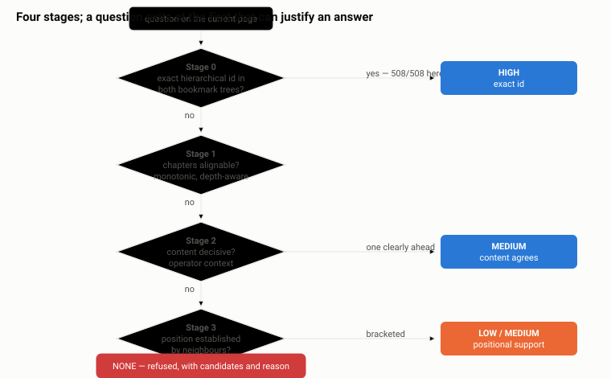
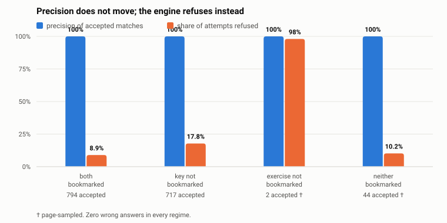
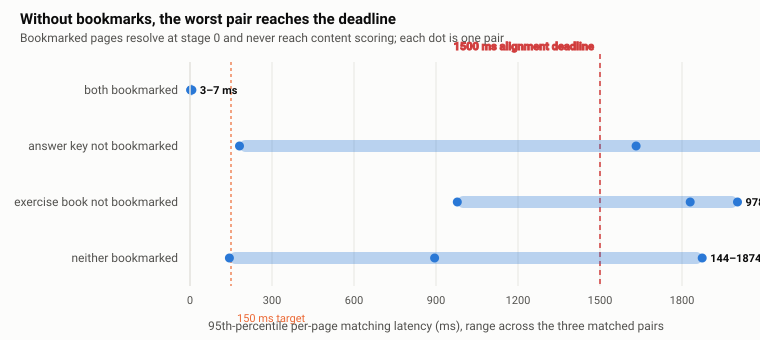
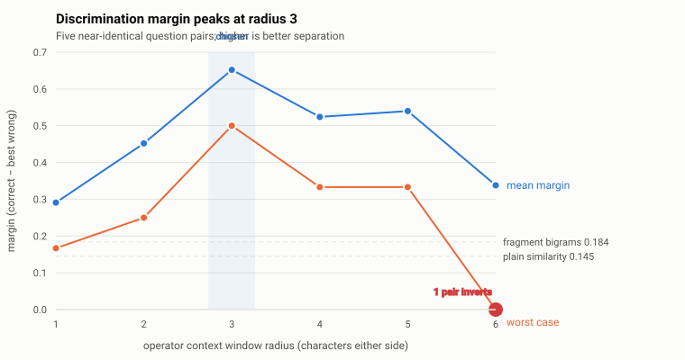

# Find-Engine: Deterministic Question–Answer Alignment Across Paired Mathematics PDFs

**A technical report**

*Version 1.0 — 25 August 2026*

---

## Abstract

We describe Find-Engine, a deterministic system that aligns exercises in a
mathematics textbook with their solutions in a physically separate answer key,
given only the two PDFs. The problem is a constrained instance of monotonic
sequence alignment, but differs from bitext alignment in two respects that
change the design: the documents supply structural anchors (hierarchical
question identifiers and bookmark trees) that plain prose does not, and the cost
of a wrong alignment is asymmetric — showing a student the wrong worked solution
is worse than showing none.

The system is organised as admission gates followed by a cost-ordered cascade.
The gates establish document roles, pair identity and text-layer usability
before any question is matched; the cascade stops at the first stage that can
justify an answer. Two decisions are kept apart throughout: *which* entry to
return, and *how much to trust it*.

The evaluation corpus is eight published 考研数学 volumes forming three matched
pairs with bookmark trees on both sides, one scanned pair, and sixty invalid
combinations. On the three matched pairs the identifier stage alone resolves
508, 271 and 217 questions with zero errors at 95th-percentile per-page
latencies of 1–2 ms. Across all sixty invalid combinations — wrong year, wrong
subject, two answer keys, two exercise books, reversed roles — the system emits
no automatic answer at all.

We report an architectural finding and four negative results. The finding is
that most of what looked like a precision/recall frontier was defect: three
faults each cost both axes simultaneously, and repairing them raised recall
without moving precision. The negative results are a positional prior that
appeared safe by construction yet returned 120 of 120 wrong answers on
non-parallel documents; a confident misdiagnosis of font corruption that was a
missing reader configuration; a correctness measurement that was very nearly
circular and therefore could not have failed; and the observation that requiring
all of N structural agreements from noisy input fails multiplicatively with N,
so a rule that is correct in principle refuses correct answers in proportion to
question complexity rather than to error.

## 1. Introduction

### 1.1 Problem statement

Let *E* be an exercise book and *A* an answer key, published as separate PDF
documents. *E* contains a sequence of numbered questions; *A* contains a
sequence of entries, each the worked solution to one of them. The task is to
compute, for each question *q ∈ E*, either the entry *a ∈ A* that solves it, or
an explicit refusal.

The naive formulation — match by printed question number — fails immediately,
because numbering restarts at each chapter. A bare "12" is unambiguous within a
chapter and meaningless across a book. The naive repair — match by text
similarity — fails for a different reason: on a page of derivative exercises,
every question reads 求函数…的导数 and the discriminating content is a short
mathematical expression embedded in near-identical prose.

### 1.2 Asymmetric cost

The application is a study tablet on which a student works through exercises. A
missing answer is an inconvenience: the student turns to the key themselves. A
*wrong* answer is a different category of failure. It is presented with the
same authority as a correct one, the student has no way to detect it, and every
downstream stage — grading, error localisation, feedback — is then confidently
wrong about work that was correct.

This asymmetry is the organising constraint of the system. Throughout, we treat
precision as an invariant to be preserved and recall as a quantity to be
maximised subject to it. Several design decisions reported below sacrifice
substantial recall for precision, and one component is shipped disabled because
it could not honour the constraint.

### 1.3 Contributions

1. **Admission gates ahead of matching.** Document role, pair identity and
   text-layer usability are established before any question is considered, and
   are derived by the system rather than accepted from the caller. Across sixty
   invalid document combinations the result is zero automatic answers, against
   fifty-two leaking combinations for a design that accepted verification facts
   as parameters.
2. **A five-outcome decision ladder** separating what the system is willing to
   assert from what it managed to establish, so that refusing to answer does not
   collapse into returning nothing.
3. **Structural classification of document metadata**, in which an identifier is
   not taken as evidence of a question. The rule it replaces turned 18 section
   bookmarks into 479 confident wrong answers on a volume lacking a question
   level.
4. **The printed table of contents read as a label-to-location index**, with the
   printed-to-PDF page offset recovered by agreement between two independent
   readings rather than assumed, and locations emitted only where they agree.
5. **An operator-anchored context representation** for mathematical similarity
   that widens the decision margin on near-identical questions from 0.107 to
   0.466, with the window radius selected by measurement.
6. **A text-layer quality gate** distinguishing seven failure modes, including a
   coverage state that no character-ratio test can express, and which in
   practice detected a misconfiguration in the host application.
7. **An ablation methodology** scored against an oracle independent of the text
   layer under test, cross-checked by a second oracle sharing no failure mode
   with the first.
8. **Four documented negative results with their measurements**, including a
   correctness metric that could not have failed and a conjunctive rule that
   refuses in proportion to complexity rather than to error.

**Figures.** 1 — the stage cascade (§3.1). 2 — precision against refusal rate
under ablation (§5.4). 3 — per-page latency by regime (§5.5). 4 — the operator
window radius sweep (§6.1).

## 2. Related work

The alignment machinery is standard; the domain handling is not. We situate the
system against sentence- and document-alignment literature.

| System | Shared ground | Differences | Relationship |
|---|---|---|---|
| Gale–Church | Monotonic alignment of ordered segments | Length statistics only; no structural anchors | Positional prior baseline (§7.1) |
| Hunalign | Monotonic matching, gap handling, non-crossing constraint | Bilingual corpora; sentence length and dictionaries | Gap-penalty formulation |
| Bleualign | Similarity combined with sequence order | Requires machine-translation output | Evaluation design |
| Maligna | Whole-sequence optimisation over per-item scoring | General bitext framework | The whole-alignment framing |
| Vecalign | Long-document alignment, DP, gaps, many-to-many | Embedding-based; no document structure | Candidate reduction |
| Bitextor | Extraction → discovery → alignment pipeline | Multilingual web corpora; heavier | Stage-level quality gates |

Two asymmetries distinguish this problem from bitext alignment.

**It is easier.** Bitext aligners must infer correspondence from content alone.
Here, hierarchical question identifiers and PDF bookmark trees provide exact
anchors. Where those anchors are present and unambiguous, the alignment problem
is a dictionary lookup, and no embedding model or DTW approximation is required.

**It is harder in one specific way.** Those anchors arrive through a PDF text
extraction layer that is frequently unreliable, and unreliable in ways that
produce plausible-looking output rather than obvious errors. A substantial part
of the system is therefore concerned with deciding what not to trust — a
concern largely absent from the bitext literature, which typically assumes clean
input.

---

## 3. System design

### 3.0 Admission gates

Nothing about a question is decided until three questions about the *documents*
are. The gates run in order, and each can end the enquiry:

| Gate | Question | Failure |
|---|---|---|
| Role | Is the left an exercise book and the right an answer key? | `BLOCKED` |
| Identity | Are these the same book — year, subject, sampled content anchors? | `BLOCKED` on conflict, `UNKNOWN_PAIR` on absence |
| Text quality | Does the text layer actually cover the document? | `OCR_REQUIRED` |

The distinction between a *conflict* and an *absence* carries the design. A year
or subject that disagrees is positive evidence of the wrong book and rejects the
pair outright. Evidence that is merely missing — a scanned volume whose content
anchors cannot be sampled at all — yields `UNKNOWN_PAIR`, which withholds
automatic answers while still permitting the lower rungs of §3.8. Rejecting on
absence would block every document the system cannot read, in exchange for
safety the automatic-answer ban already provides.

Role is judged on indexed entries rather than raw lines. Line density does not
separate the two roles on this corpus at all: exercise volumes run 14 to 71
lines per page and answer volumes 51 to 103, and the ranges overlap. What
separates them is whether the material attached to each *question* works the
problem. Measured over entries, answer keys score 98.8–100% on solution language
and 98.9–100% on yielding an explicit marked answer; exercise volumes score
76.0–93.1% and 37.3–95.5%. Either measure alone leaves a pair within a couple of
points; requiring both separates every document in the corpus.

These thresholds were calibrated on bookmark-derived indexes, and they do not
transfer to body-parsed ones — an answer key stripped of its bookmarks scores
0.969 against a 0.970 threshold and reads as an exercise book. A body index may
therefore *confirm* an answer key but may never confirm the absence of one. Three
separate false rejections of valid pairs were traced to this single mistake, and
§7.5 treats it as a finding rather than a bug.

Critically, none of these facts crosses the public interface. An earlier design
accepted `exactId`, `sectionAligned` and `pairStatus` as arguments, and measured
across the sixty invalid combinations of §5.1, fifty-two produced confident
answers. Verification facts are conclusions, and deriving them is the module’s
work.

### 3.1 The cascade

Four stages, ordered by cost. A question stops at the first stage that resolves
it, so the expensive stages run only on the residue.



**Figure 1.** The cascade. Cost rises left to right; a question exits at the
first stage that can justify an answer. The refusal exit is reachable from every
stage, and is the only outcome when evidence is absent — never a default.

| Stage | Signal | Resolves | Cost |
|---|---|---|---|
| 0 | Hierarchical identifier from bookmark tree | Identifier present exactly once in both documents | O(1) |
| 1 | Table-of-contents alignment | Narrows candidates to one chapter | Once per document pair |
| 2 | Math-weighted similarity with operator context | Duplicate or absent identifiers | O(candidates) per question |
| 3 | Monotonic alignment (Needleman–Wunsch) | Position, when content is uninformative | O(nm), bounded |

### 3.2 Stage 0: hierarchical identifiers

Questions in this corpus are numbered hierarchically — `1.1`, `1.200`, `2.231` —
encoding chapter and position. The hierarchy is the identity. Parsing such
identifiers as flat integers, as an earlier version did, collapses 508 distinct
questions onto 2 identifiers.

Identifiers are canonicalised per segment, so that leading zeros normalise
(`01.020` → `1.20`) while `1.1` and `1.10` remain distinct. Whole-string numeric
normalisation would conflate the latter pair, which is the same class of error
as truncation.

Subquestion markers — `(1)`, `(2)` — restart within *every* question. Promoting
them to top-level entries manufactures hundreds of duplicate `1`s and converts a
clean unique-identifier lookup into mass forced ambiguity. They are therefore
attached to their parent question and never compete as identifiers.

Identifiers are taken from the PDF bookmark tree in preference to body text.
Bookmarks are structural: they survive font problems, layout irregularity and
extraction noise that defeat text parsing. Question bookmarks are distinguished
from section headings structurally rather than lexically — either by a 例题
marker or by occupying the deepest level of the outline — so the test itself
does not depend on the text layer.

### 3.3 Stage 1: table-of-contents alignment

For document pairs whose identifiers do not correspond, chapter titles are
aligned to bound the search. Titles rarely match exactly (第三章 导数与微分（答案）
against 第三章 导数与微分), so pairing is by similarity.

Two properties are enforced. Pairing is **monotonic**, computed by
Needleman–Wunsch rather than greedily: a greedy pairing can match chapter 5 with
chapter 2's solutions whenever titles happen to score higher, producing a page
range that contains no correct answer and giving no visible symptom. Pairing is
also **depth-aware**: sections align only against sections at their own outline
level, because `1.1 极限与连续函数` and `例题 1.1` are similar enough to pair with
each other when depth is ignored, and the shorter title often wins.

### 3.4 Stage 2: operator-anchored similarity

Content similarity is computed over character bigrams (Dice coefficient),
weighted 0.75 toward extracted mathematical fragments. Fragments are kept whole
rather than reduced to symbol sets, because `x^2+3x` and `x^3+5x` contain
identical symbols and differ only in arrangement. Brackets are canonicalised
rather than deleted: deleting them makes `1/(x+1)` and `1/x+1` the same string,
which is not a formatting difference but a different function.

The principal refinement is **operator context**. A bigram coefficient is a
*bag*: it counts which pairs occur, not where. Two derivative exercises share
almost all bigrams of their prose and most of their expression, leaving a thin
margin. The discriminating information is local to the operators, so each
operator occurrence is anchored and a fixed window taken either side:

```
x^2+3x   →   "··x^2+3"   "x^2+3x·"
x^3+5x   →   "··x^3+5"   "x^3+5x·"
```

Neither token matches, where a bigram bag shares `x^`, `+` and `x`. Similarity
is the Dice coefficient over these context multisets. The signal is suppressed
when either side has fewer than two operator anchors, since a single anchor is
one coincidence wide, and prose questions have none.

Window radius selection is reported in §6.1.

### 3.5 Stage 3: bounded monotonic alignment

Questions appear in the same order in both documents, so a crossing alignment is
structurally impossible. Needleman–Wunsch over the two sequences enforces this
and guarantees that no two questions claim the same entry. Gaps are modelled
rather than forced: a question absent from the key remains unpaired instead of
dragging a wrong partner into the alignment.

Positional support falls out of the formulation — when *q₄* and *q₆* both match
strongly, *q₅* follows from position even with a weak content signal — and is
applied one step only, so that a single strong neighbour cannot vouch for a run
of guesses.

The alignment is bounded three ways: candidate count, a diagonal band, and a
wall-clock deadline. Exceeding the deadline reports a timeout rather than
returning the partial table's answer, which would be an arbitrary alignment
presented as a real one.

### 3.6 Text-layer quality gate

"The PDF returned text" is not "the PDF returned its text". The gate classifies
an extraction by measuring control-character rate, the rate of characters from
scripts that cannot legitimately appear in the document’s language, the presence
of the expected script, and — separately from all of those — how much of the
document the layer covers at all.

| State | Meaning | Remedy |
|---|---|---|
| `USABLE` | Reads as the language it should | — |
| `DEGRADED` | Readable, noisy; supporting signal only | — |
| `OPAQUE` | Unreadable but internally consistent | Check the reader’s configuration |
| `CORRUPT` | Text present, carrying nothing usable | Bookmarks, or OCR |
| `SPARSE_LAYER` | Readable, and covering almost none of the book | OCR |
| `BLANK` | Text layer present and empty | None needed |
| `SCANNED` | No text layer | OCR |

The distinctions matter because the remedies differ, and because a system that
reports "no answers found" for a scanned book has told the user nothing
actionable. The gate’s practical value is documented in §7.2, where it detected
a defect in the host application rather than in any document.

`SPARSE_LAYER` is the state this gate was missing, and it is worth stating why
it was missed. Every other verdict is a *ratio* — what share of characters are
Han, are noise, are structured — and a ratio cannot see how few characters there
are. The 2025 exercise volume yields 609 characters across 465 pages, 48.9% of
them Han, on 0.7% of its pages. Every ratio reads as healthy, and the document
classified as `USABLE` while being a scan with a handful of stray text objects
on it. Coverage is a different question from decodability, and asking only the
second is how a scanned book passes a quality gate.

The separation is not delicate: every genuine text layer in the corpus covers
100% of its pages at 188 to 1,664 characters per page, against 0.7% and 1.3.
Coverage is judged only when the caller states how many pages were read, and
only for documents long enough for coverage to mean anything — a one-page
extract has none to speak of.

### 3.7 Confidence and abstention

Confidence is derived from **how many independent signals agree**, and is
computed by a mechanism separate from the alignment.

| Confidence | Basis |
|---|---|
| `HIGH` | Exact bookmark identifier, or chapter alignment + number + content |
| `MEDIUM` | Two signals agree |
| `LOW` | One weak signal; displayed with visible caution |
| `NONE` | Refused; candidates and reason returned |

The separation is deliberate. The dynamic program decides *which* entry; the
per-question rules decide *how much to trust it*. Without the split, the
ordering constraint could manufacture certainty the evidence does not support: a
tidy alignment of uniformly weak matches is still weak.

A specific consequence: **a duplicated identifier with no section alignment is
refused, never settled by position.** The alignment always produces *some*
assignment, and accepting it would convert genuine ambiguity into a confident
wrong answer. An abstention retains its evidence — candidate identifiers, pages
and reason — so that neither the next stage nor the user must rediscover it.

---

### 3.8 Five outcomes, not two

Refusing to *answer* need not mean refusing to *help*, and collapsing the two
forced a false choice between accuracy and coverage. A result carries one of
five claims:

| Rung | Claim | Can be wrong in the costly way? |
|---|---|---|
| `AUTO_MATCH` | this entry is the answer | yes — everything else protects this |
| `REVIEW` | one of these few is | no; it asserts no choice |
| `LOCATED` | the answer lies in these pages | no; a range, not an identity |
| `REFUSED` | not enough to say anything | no |
| `BLOCKED` | these documents do not belong together | no |

Three properties are enforced. A rung is a *ceiling*, never a target: no
component may promote a result to improve a coverage figure. Lower rungs carry
their evidence, so a refusal does not force the next stage to rediscover what it
saw. And only `AUTO_MATCH` counts toward strict precision, so improving the
lower rungs cannot disguise a precision regression.

The rung a pair may reach depends on its status: a `VERIFIED_PAIR` may use all
three answering rungs, an `UNKNOWN_PAIR` may locate and review but never answer,
and a `REJECTED_PAIR` may do nothing. The reported `matched` flag follows the
rung, so a single weak signal can no longer arrive at a reader as a final
answer.

### 3.9 Structure, and what an identifier is not

A bookmark carrying an identifier is not a question because it carries one. The
earlier rule — identifier-bearing nodes at the deepest outline depth are the
questions — holds only while a question level exists. On a volume whose question
bookmarks are simply absent, the deepest surviving level *is* the section level,
and every section is promoted: measured on the 2025 exercise volume, its 18
section bookmarks became 18 questions and produced 479 accepted matches at high
confidence, all wrong, at a true-question recall of 0 of 573.

Classification is therefore structural and decided per outline depth rather than
per node, because a bookmark tree is written by one tool following one
convention and the level is the unit that carries it. Explicit markers (例题,
习题) settle it where present; otherwise child count, page span, and the
*descriptive residue* of the title do. That last signal is what survives losing
the question level: a section title says what the section is about and a question
bookmark does not. "1.1 极限与连续函数" retains seven descriptive characters after
its identifier is removed; "例题 1.1" retains none.

The same discipline is needed in body text, where it was also missing. The
section running head "1.1 极限与连续函数" is printed on 22 pages of the 2023
exercise volume and parsed as question 1.1 on every one of them; 205 of 712
body entries opened with a line of that kind. Two independent disqualifiers
apply: a line that repeats across pages is a running head, since a question is
printed once; and where a volume marks its questions, an unmarked line carrying
a descriptive title is a heading.

Ties break toward `SECTION` deliberately. Mistaking a question for a section
costs coverage; mistaking a section for a question costs precision, and the
section will then match something.

### 3.10 The printed table of contents as an index

A volume without a bookmark tree is not a volume without structure. It almost
always prints a table of contents, and that contents is precisely what the
missing bookmarks would have supplied: a label-to-location map produced by the
typesetter rather than inferred from prose. On the 2023 answer key it lists 508
of 508 identifiers.

The obstacle is that a contents row gives a *printed* page, offset from the PDF
page index by however much front matter precedes it. Guessing that offset would
relocate the whole book. It need not be guessed: every identifier appearing in
both the contents and the body parse votes on `pdfPage − printedPage`, and the
mode is the offset. Measured, 492 of 508 identifiers vote +18.

Applying the modal offset to all 508 would place 492 correctly and 16 wrongly.
The 16 failures are exactly those where the contents and the body parse
disagree, so they are identifiable in advance without ground truth. Emitting a
location only where two independent readings agree yields 492 locations, and
scored afterwards against the bookmark oracle every one is correct.

This is the same principle the rest of the system runs on — confidence from
independent signals agreeing — applied to two readings of one document.

## 4. Corpus

Eight published volumes of Chinese postgraduate-entrance mathematics (考研数学),
forming three matched exercise/answer pairs with question-level bookmarks on
both sides, and one pair whose exercise volume is a scan.

| Document | Pages | Lines | Characters | Question bookmarks |
|---|---:|---:|---:|---:|
| 2023 exercise book | 368 | 5,260 | 69,375 | 508 |
| 2023 answer key | 372 | 18,996 | 294,819 | 508 |
| 2024 Mathematical Analysis, exercises | 200 | 14,164 | 243,509 | 271 |
| 2024 Mathematical Analysis, answers | 202 | 20,800 | 336,156 | 271 |
| 2024 Advanced Algebra, exercises | 197 | 9,316 | 188,815 | 217 |
| 2024 Advanced Algebra, answers | 199 | 14,385 | 270,899 | 217 |
| 2025 exercise book (scanned) | 465 | 65 | 609 | 0 |
| 2025 answer key | 321 | 17,658 | 251,320 | 573 |

The 2025 exercise volume is the interesting one. It carries a text layer, and
that layer is worthless: 609 characters across 465 pages, present on 0.7% of
them. Every character-ratio test a quality gate might apply passes on it,
because the handful of characters recovered are perfectly good Chinese. It is
the case that motivates §3.6.

The three matched pairs give 1,992 questions with independent ground truth on
both sides. Sixty further combinations are formed by pairing documents that do
not belong together — wrong year, wrong subject, answer against answer, exercise
against exercise, and the reversed orientation — and are used in §5.1.

The corpus is extracted text and bookmark trees, not the PDFs. It is rebuilt by
a tool that drives the host application’s own PDF layer rather than
reimplementing extraction, because line grouping is a judgement call — fragments
are bucketed into rows by baseline within a tolerance — and a corpus built with
different buckets would evaluate the system against input it never receives.

## 5. Evaluation

Every figure below is full-book unless a sampling stride is stated, and every
accepted result that cannot be tied to independent ground truth counts as
wrong rather than as an exclusion.

### 5.1 Refusing the wrong documents

Sixty combinations are formed from the eight volumes by pairing documents that
do not belong together. All are exercised through the public interface, because
the defect being measured is precisely that a caller could bypass a gate;
testing an internal helper would establish nothing.

| Category | Combinations | Producing an automatic answer |
|---|---:|---:|
| Answer key from the wrong book | 12 | **0** |
| Answer key paired with an answer key | 16 | **0** |
| Exercise book paired with an exercise book | 16 | **0** |
| Reversed orientation | 16 | **0** |
| **Total** | **60** | **0** |

Fifty-three are blocked at document level — 24 on the right-hand role, 20 on the
left-hand role, 9 on identity — and the remaining seven are held at
`UNKNOWN_PAIR`, which cannot answer. The earlier design leaked 52 of 60, with
11,629 confident wrong probes.

The two gates are not interchangeable, and the corpus shows why. An answer key
compared against *itself* scores a perfect 100% on content anchors, because it
genuinely is the same content: identity cannot see that error, and only the role
check rejects it. Conversely a 2023 exercise volume against a 2025 answer key
has entirely correct roles and is still the wrong pair.

### 5.2 Capability, with structure intact

| Pair | Resolved | Wrong | p95 per page |
|---|---:|---:|---:|
| 2023 | 508 / 508 | **0** | 1 ms |
| 2024 Mathematical Analysis | 271 / 271 | **0** | 2 ms |
| 2024 Advanced Algebra | 217 / 217 | **0** | 1 ms |

All resolve at stage 0. The result is unrepresentative by construction — it
measures one stage — and the remaining stages are evaluated by ablation.

### 5.3 Ablation methodology

To exercise the later stages the bookmark trees are removed and the system is
forced onto body-text parsing. Scoring such runs is subtle, and an earlier
informal attempt was invalid: it compared body-parsed matches against
body-parsed labels, which grades the text layer against itself.

The oracle is instead constructed **from the bookmark trees**, which are
structural and wholly independent of the text layer the ablated runs must rely
on. A match counts only when two independent facts agree: the parsed label is a
real identifier, *and* the bookmark tree independently places that identifier on
the page where the parser found it. Matches failing this are reported as
*unidentifiable* rather than discarded, since discarding them would let the
parser conceal its own errors.

A second, independent oracle is available and is used as a cross-check: the
answer’s own printed body carries the question’s label. Measured across the
three matched pairs, the true label is present in 100.0%, 99.6% and 99.5% of
correct answers, and a *different* question’s label in 0.0%. The two oracles
share no failure mode, so a silently mis-built bookmark tree cannot certify a
match on its own. A contradiction between them is treated as fatal; silence —
the label simply absent, which happens when an entry’s page range excludes its
own heading — is tolerated at its measured rate.

### 5.4 Degraded structure

Precision never falls, and no valid pair is ever rejected for missing a bookmark
tree. What changes is which rung carries the recall.

Two repairs account for most of the recall that a naive ablation loses. The
2023 answer key prints its own table of contents, so body parsing found every
identifier twice and refused 825 of 872 lookups as ambiguous — with the true
answer among the two candidates every time. And running heads inflated
similarity between unrelated entries. Excluding both is not a precision/recall
trade: the surplus entries were never right, and their presence suppressed the
entries that were. With the printed contents additionally read as an index
(§3.10), unique recall in the no-answer-bookmarks regime moves from 8 of 508 to
490, and per-page p95 from 204 ms to 1 ms, because a corroborated location
resolves without content comparison.



**Figure 2.** Precision of accepted matches against the share of attempts
refused. Precision is invariant; the cost of preserving it is visible as the
refusal rate.

### 5.5 Latency, and a deadline that becomes load-bearing



**Figure 3.** 95th-percentile per-page matching latency, as a range across the
three matched pairs; each dot is one pair. A single bar would hide that the same
regime costs 61 ms on one pair and 808 ms on another.

| Regime | p95 across the three pairs |
|---|---:|
| Both bookmarked | 1–3 ms |
| Answer key not bookmarked | 61–808 ms |
| Exercise book not bookmarked | 327–1,573 ms |
| Neither bookmarked | 51–925 ms |

Bookmarked pages never reach content scoring, which is why the first row is flat
against the axis. The rest are governed by how much body text each question must
be compared against, and the 2024 volumes — whose entries carry two to three
times the text of the 2023 pair — dominate the upper end of every range.

The upper end matters more than the spread. At 1,573 ms the worst regime has
reached the 1,500 ms alignment deadline, which means results there are produced
by expiry rather than by decision. The system reports a timeout instead of
returning the partial table’s answer, so the failure is safe — but a deadline
that is being *reached* is no longer a backstop, it is the mechanism, and a
measurement taken at that point describes the deadline rather than the
algorithm. Bounded candidate retrieval is the outstanding work, and until it
lands the degraded regimes should be read as "refuses within 1.5 s", not as a
latency figure.

The figure is generated from `figures/latency-by-regime.data.json`, which
`tools/measure-regimes.mjs` produces. An earlier revision hardcoded these
numbers into the drawing script, and they went stale silently: the figure
claimed 507 ms for a regime then measuring 327.

### 5.6 A scanned volume

The 2025 exercise volume has no usable text layer and no question bookmarks. A
recognizer built from facilities already present on the host — page rendering
plus the operating system’s OCR engine — reads all 465 pages with zero page
failures in 6.7 minutes, moving the document from `SPARSE_LAYER` to `USABLE`
and indexing 607 questions where there were none.

Recognition alone unlocks no automatic answers, and should not: identity cannot
be established from OCR-derived anchors, so the pair remains `UNKNOWN_PAIR` and
the system offers review and page locations instead. A user-confirmed binding
supplies the identity the system cannot derive, and is validated against both
documents’ fingerprints so that replacing either file invalidates it.

**What follows is not an accuracy measurement, and the distinction is the point
of §7.3.** After binding, the system emits 178 automatic matches covering 108
distinct real identifiers of 573. There is no oracle for *where* a question sits
in this volume — the absence of question bookmarks is why OCR is involved — so
correctness cannot be scored. What can be checked is whether the identifier was
printed on the page the match came from:

| | |
|---|---:|
| Automatic match events | 178 |
| From a page printing that identifier | 100 |
| From a continuation page | 78 |
| Identifiers seen *only* on continuation pages | 8 |
| Distinct identifiers, raw | 108 / 573 (18.85%) |
| Distinct identifiers, start-page aligned | 100 / 573 (17.45%) |
| Order breaks (backward steps) | 0 of 178 |
| Order inversions (pairs out of order) | 0 of 15,753 |

The order figures are two measurements, not one. A *break* is a place where the
recognised sequence steps backwards; an *inversion* is any pair of matches
reading in the opposite order to the answer book. An earlier revision reported
the first under the second's name, which understates what a single misplaced
label costs: one label read far too early is a single break but as many
inversions as there are matches it jumped over. Both are zero here, so the
distinction changes nothing about this result — it changes what the number
would have said had it not been.

A visual audit of eight sampled pairs found seven correct and one wrong, so the
error rate is neither zero nor presently known. For comparison, the same volume
before the structural work of §3.9 produced 479 confident wrong answers.

## 6. Ablations and parameter selection

### 6.1 Operator context window radius

Swept over five pairs of near-identical questions — identical prose, mathematics
differing only in grouping, sign, exponent or coefficient — measuring the margin
between the correct and the best wrong candidate.

| Radius | Mean margin | Worst case | Inversions |
|---|---|---|---|
| 1 | 0.291 | 0.167 | 0 |
| 2 | 0.452 | 0.250 | 0 |
| **3** | **0.652** | **0.500** | **0** |
| 4 | 0.524 | 0.333 | 0 |
| 5 | 0.540 | 0.333 | 0 |
| 6 | 0.338 | 0.000 | **1** |
| *plain similarity* | *0.145* | *0.107* | *0* |
| *fragment bigrams* | *0.184* | *0.160* | *0* |



**Figure 4.** The margin between the correct and the best wrong candidate, by
window radius. Both baselines are shown dashed. The peak at radius 3 is the
selection criterion; the marked point at radius 6 is a pair whose ordering
inverts — the wrong candidate outscores the correct one.

The curve is interpretable. At radius 1–2 the window holds a fragment of an
operand with no redundancy: two expressions differing in one position either
collide with that position or miss it entirely. At radius 3 the window spans a
complete operand in this notation — coefficient, variable, exponent — and is the
smallest window capturing an operand *as a unit*. At radius 5–6 the window
reaches past its own operand into the neighbouring term, so expressions
differing in one place share context tokens again through the parts that match;
at 6, one pair inverts outright.

On the representative derivative pair, the decision margin improves from 0.107
(plain similarity) to 0.160 (fragment bigrams) to **0.466** with operator
context. Operator context alone scores 0.857 against 0.000.

### 6.2 Effect on duplicate resolution

With no table of contents and per-chapter numbering, resolution of duplicated
identifiers improves from 54/120 to **114/120** at unchanged 100% precision, and
holds 100% precision on three adversarial non-parallel document pairs where a
positional approach fails (§7.1).

---

## 7. Negative results

### 7.1 A positional prior that fails silently

**Hypothesis.** Where identifiers are duplicated and no table of contents is
available, position should disambiguate: a question 30% through the exercise
book should pair with an answer near 30% through the key. This is the positional
half of Gale–Church applied to ordinal position.

**Safeguard.** The prior accepts only when *exactly one* candidate falls inside
the expected window — separating the alternatives rather than ranking them. A
ranking would let the nearest of two plausible candidates win; separation
appeared to avoid that.

**Result.**

| Condition | Recall | Precision |
|---|---|---|
| Documents genuinely parallel | 0% → 100% | 100% |
| 10 questions absent from key | 0% → 83% | 100% |
| 8 extra entries in key | 0% → 100% | 100% |
| Key's chapter 1 inflated 10× | — | **19%** |
| Key's chapters reversed | — | **0%** (120 of 120 wrong) |
| Key missing chapters 1–3 | — | **17%** |

**Analysis.** Solitude inside the window is not evidence of correctness. When the
documents are scaled differently, the window lands over the *wrong* chapter's
copy of the identifier, and its being alone there makes it appear unambiguous.
Every one of the 120 reversed-chapter errors was returned at `MEDIUM` confidence.

**Disposition.** The component is implemented and retained, disabled by default,
with its measurements in the source. A signal that cannot detect its own
inapplicability cannot honour an asymmetric-cost constraint. Content resolves the
same cases at 100% precision, because similarity is indifferent to document
order.

### 7.2 A confident misdiagnosis

**Observation.** All four volumes of the corpus as it then stood extracted with
0–1.9% Han characters — Chinese
textbooks apparently containing no Chinese. Extraction reported no error, and
similarity scores fell in their normal range.

**Initial diagnosis.** Broken embedded CJK fonts with defective ToUnicode maps.
Substantial machinery followed: a quality state for text that is unreadable but
internally consistent, an alphabet-overlap test to decide whether two documents
were corrupted identically and could therefore be compared, and a learner that
recovers a font's substitution table by aligning OCR output against the text
layer. All of it measured well — the corruption *was* a consistent substitution,
sharing 334 of 335 characters between the paired documents, and ranking the
correct answer first 95.8% of the time.

**Actual cause.** pdf.js cannot decode CID-keyed CJK fonts without CMap files.
Neither the corpus extractor nor the host application supplied them. The fonts
were never defective.

```
without cmaps   ২ี 1.1 2023.॓࿐ჽն࿐ ჰ PDFֻ4 ်
with cmaps      例题 1.1 2023. 中国科学院大学 原 PDF 第 4 页
```

Correctly configured, the corpus reads 23–28% Han with 0% odd-script and 0%
control characters, and the gate classifies every volume `USABLE`.

**What survived.** The bookmark-first design was correct, but for a different
reason than originally given: the outline is the better signal because it is
*structural*, not because the text was unusable. The 508/508 result is unchanged.
With correctly decoded text, the ablated regimes improve substantially.

**What was built for a non-existent problem.** The `OPAQUE` state and the glyph
learner. Both are retained — genuinely defective embedded fonts do occur, and
both components are correct and tested — but the documentation now states that
a caller encountering `OPAQUE` should suspect their reader's configuration before
concluding anything about the document.

**Why the gate is vindicated rather than undermined.** The misdiagnosis was
detected *because* the quality gate refused to treat the extraction as normal.
Without it, the system would have matched noise against noise while reporting
ordinary confidence, and the defect would have reached production invisibly. A
regression test now feeds the gate the undecoded form to keep that alarm
functioning.

---

### 7.3 A measurement that could not fail

The scanned volume of §5.5 was first reported as **178 automatic matches, 178
correct, zero wrong**. The correctness half of that was withdrawn. It is worth
setting out how it passed review, because the fault is not arithmetic.

The measurement asked whether the matched *answer* page fell inside that
identifier’s gold answer span. It omitted the second half of the test used
everywhere else in this work — that the *exercise* page also falls inside the
question’s span, with an unconfirmable accept counted as wrong.

Without that second fact the check is very nearly circular. OCR reads identifier
1.5; the system looks up 1.5 in the answer index; the result lands in 1.5’s
answer span **by construction**. The check could scarcely have failed, and it
reported zero wrong because it could not have observed a wrong answer had one
existed.

What makes this worth reporting is that no correct version of the measurement is
available. The volume has no question-level bookmarks — the reason recognition
is involved at all — so nothing independent says where a question sits in it.
The answer side can be checked; the question side cannot. The honest response is
not a better score but a different claim: report what *can* be established
(whether the identifier was printed on the page the match came from, and whether
the identifiers run in the book’s order), and state plainly that accuracy is
unmeasured.

The general lesson is that a metric whose failure mode is unreachable will
report success indefinitely, and will do so most convincingly in exactly the
regime where independent ground truth is missing — which is the regime where
one is most tempted to trust it.

### 7.4 Requiring all of N fails multiplicatively

A product rule was specified: an automatic match must have a counterpart in the
answer for *every* complete mathematical expression in the question, with no
structural conflict. The rule is defensible in principle — partial agreement is
weak evidence — and it was measured against 1,992 known-correct pairs.

As originally specified it would have refused 218 of 400 correct 2023 pairs and
**every** correct pair in both 2024 volumes. Median coverage on true pairs was
0.41 to 0.89, because an answer entry routinely states only its result: the rule
demanded of the corpus something the corpus does not contain.

Most of that gap was not the rule’s fault but the input’s. An entry’s text was
its whole *page range*, so the expressions attributed to a question were partly
its neighbours’. Bounding each entry by the printed headings the book itself
supplies, cleaning running heads and page numbers out of the character stream
(they arrive glued *inside* expressions — `…=0x` against `…=035x`, where 35 is a
page number), and comparing expressions by similarity rather than string
equality raises the share of correct pairs reaching full coverage from 42.5% /
0% / 0% to 92.5% / 60.5% / 78.8%, with decoy pairs unmoved at 0% throughout.

What remains is structural, and is the finding. Full coverage falls with
question size:

| Expressions in the question | Pairs | Reaching full coverage |
|---:|---:|---:|
| 1–2 | 120 | 76.7% |
| 3–5 | 98 | 59.2% |
| 6–10 | 22 | 45.5% |
| 11+ | 31 | 12.9% |

Each expression carries an independent chance of an extraction artefact, so
requiring all of N succeeds with probability roughly p^N. A rule of this shape
therefore refuses correct answers in proportion to **question complexity**
rather than to error — a long, correct, well-matched question is refused more
often than a short one, which is the opposite of what the rule intends.

Enforced as specified it costs 7.5%, 41.3% and 19.4% of recall across the three
pairs and buys, on this corpus, no precision at all: both policies produce zero
wrong matches, because the identifier is already correct on all 1,992 questions.
The rule ships enforced by default with the cost measured and a documented
switch, and both branches are exercised in the test suite so neither can drift.
Whether the trade is worth making is a product decision, and stating it as such
is more useful than quietly relaxing the rule.

### 7.5 Thresholds do not survive a change of representation

Three separate false rejections of *valid* pairs were traced to one mistake made
three times: a threshold calibrated against one representation of a document was
applied to another.

| Signal | Calibrated on | Applied to | Symptom |
|---|---|---|---|
| Role classifier | outline-derived entries | body-parsed entries | an answer key scores 0.969 against 0.970 and reads as an exercise book |
| Role source list | outline indexes | contents-corroborated indexes | same, one step removed |
| Content anchors | two outline indexes | an over-extracted body index | a valid 2024 pair rejected once its exercise bookmarks are removed |

A fourth instance appeared inside this work rather than before it. Narrowing
entry text to the question that owns it — the repair of §7.4 — cut 2024 answer
entries from 3,265 characters to 587, which moved every threshold calibrated
against the wider text at once and rejected two valid pairs. The fix was not to
recalibrate but to stop conflating two jobs: the page-range text remains the
entry’s text, and the scoped text exists alongside it for evidence that must not
be contaminated by neighbours.

The rule that emerged, and that the system now enforces: a measure may confirm a
property from a representation it was calibrated on, but may never confirm the
*absence* of that property from a representation it was not. A conflict rejects;
missing evidence does not.

## 8. Threats to validity

**Corpus homogeneity.** All eight volumes come from one publisher and share
structural conventions: 例题 markers, hierarchical numbering, consistent outline
depth, a printed table of contents with dot leaders. The structural heuristics
are fitted to those conventions, and §3.10 in particular assumes a typographic
tradition rather than a universal.

**Three matched pairs, one publisher.** End-to-end alignment is measured on
three pairs from one series. The near-miss case that identity verification will
actually be judged on — same publisher, same subject, adjacent edition — does
not exist in the corpus and could not be tested.

**No accuracy measurement for the scanned path.** §5.5 reports counts, not
correctness, and §7.3 explains why none is available. A visual audit of eight
sampled pairs is the only evidence of the error rate, and eight is not a sample.

**No clean-text baseline for the quality gate.** Every volume was initially
mis-extracted; the `USABLE`/`DEGRADED` boundary has not been exercised against a
document correctly extracted from the outset.

**Thresholds of uneven provenance.** The operator radius, glyph-learner votes,
alphabet sufficiency, formula coverage and the expression-match threshold were
swept. `SIMILARITY_STRONG` (0.55) and `SIMILARITY_WEAK` (0.30) were inherited
and never swept. The per-rung cost ratios of the confidence design are product
inputs, not measurements, and are recorded as such.

**Ablation is not absence.** Removing bookmarks from a document that has them is
not identical to a document that never had them — page ranges, layout and
numbering still reflect a structured source. The 2025 volume is the only
genuinely unstructured document here, and it is also the only one without an
oracle.

**Confidence is ordinal.** Bands are derived from how many independent signals
agree, not from a calibrated probability. Calibration requires book-level splits
the corpus cannot yet support, and a probability fitted on two usable pairs
would be a curve through noise.

**No on-device measurement.** All latency figures are desktop. Android
performance and memory are unmeasured.

## 9. Conclusion

The system meets its central objective. On the three matched pairs it resolves
every question correctly; across sixty invalid document combinations it emits no
automatic answer at all; and under ablation it produces no wrong answer in any
regime. That property is preserved by refusing, and the cost of refusing is
reported rather than absorbed.

Four observations generalise beyond this corpus.

**A signal that cannot detect its own inapplicability is unsafe under an
asymmetric-cost constraint, however well it performs where it applies.** The
positional prior was at 100% precision on every condition it was designed for
and 0% on one it was not.

**Most of what looks like a precision/recall frontier is defect.** Three faults
here cost both axes at once — sections read as questions, an over-extracting
body parser, and an alignment deadline reached often enough to be load-bearing.
Repairing each raised recall without moving precision. Work that trades one
against the other should not be scheduled until such faults are closed, because
until then the system is not on a frontier at all.

**A metric whose failure mode is unreachable will report success indefinitely.**
§7.3 describes a correctness check that could not have observed an error, and it
was most convincing precisely where independent ground truth was absent — which
is where the temptation to trust it is greatest.

**Conjunctive structural requirements fail multiplicatively on noisy input.** A
rule demanding all of N agreements refuses correct answers in proportion to
complexity rather than to error (§7.4). The remedy is not to abandon the rule
but to fix the input it reads and then state its residual cost as a product
decision.

The most informative next experiments are a document pair from a different
publisher, which would test whether the structural heuristics generalise or
merely fit; a near-miss identity case, which is what pair verification will
really be judged on; and an independent oracle for a scanned volume, without
which the recognition path can be demonstrated but not evaluated.

## Appendix A: Reproduction

The evaluation is executable:

```bash
npm test                            # all suites
npm run test:scenarios              # bookmarks, no bookmarks, invalid pairs
node tools/measure-regimes.mjs      # full-book regimes, strict metrics
node tools/measure-pair-matrix.mjs  # the sixty invalid combinations
node tools/ocr-cache.mjs            # recognise the scanned volume (~7 min)
node tools/audit-ocr-matches.mjs    # writes reports/ocr-audit.json
```

The corpus is extracted text from copyrighted textbooks and is not distributed.
`tools/extract-corpus.mjs` rebuilds it from local PDFs, and every
corpus-dependent script says plainly when it is absent, so a fresh checkout runs
green on `npm test`.

The audit is the exception, and deliberately so. It **fails** when its inputs
are missing, because a release gate that returns success for a run that did not
happen is not a gate; `--allow-skip` is the explicit way to ask for the green on
a checkout without the corpus. The same reasoning governs the recognition step:
`tools/ocr-cache.mjs` takes the page count from the PDF rather than from a
constant, refuses to write a cache if any page failed or came back empty, and
stamps what it does write with the source hash, the recognizer statistics and
the generating commit — so a cache cannot silently be of the wrong book,
or of part of the right one.

The audit reasoning of §5.5 and §7.3 lives in `src/ocr-audit.js` as a pure
function with unit tests over synthetic fixtures, so it can be verified without
the private data. Its numeric result is written to a generated artifact rather
than transcribed into prose, because an earlier revision maintained the same
figures by hand in two documents and they drifted.

| Suite | Covers |
|---|---|
| `test_tools.js` | every shipped script parses; the two release gates fail closed |
| `test_question_matcher.js` | similarity, alignment, refusal, operator context |
| `test_answer_index.js` | identifier parsing, indexing, quality states |
| `test_text_source.js` | lazy text, recognizer seam |
| `test_glyph_map.js` | glyph-table recovery |
| `test_structure.js` | structure classification, contents, boilerplate, rungs, audit logic |
| `test_matching_engine.js` | the public interface, gates, recognizer lifecycle, click regions |
| `test_real_pdfs.js` | gold sets, end-to-end, latency, formula policy |
| `test_no_bookmarks.js` | ablation against the bookmark oracle |
| `test_corpus_regression.js` | the three scenarios on the real corpus, both oracles |

## Appendix B: Measured constants

| Constant | Value | Provenance |
|---|---|---|
| Math weight | 0.75 | Inherited; margin measured |
| Operator share of math signal | 0.60 | Chosen; not swept |
| Operator window radius | 3 | **Swept** (§6.1) |
| Similarity strong / weak | 0.55 / 0.30 | Inherited; **not swept** |
| Gap penalty | −0.18 | Inherited |
| Label bonus | 0.45 | Inherited |
| Alignment deadline | 1,500 ms | Chosen |
| Glyph learner votes / agreement | 3 / 0.80 | **Swept** |
| Alphabet-overlap sufficiency | 250 distinct chars | **Swept** |
| Answer-language / explicit-answer share | 0.97 / 0.97 | **Measured** (§3.0) |
| Content-anchor top-1 share | 0.40 | **Measured**; valid pairs 58–75%, wrong-year 0% |
| Chars per page / page coverage | 20 / 0.50 | **Measured**; real layers 188–1,664 and 100%, scan 1.3 and 0.7% |
| Contents offset agreement | 0.60 modal share | **Measured**; 492 of 508 vote +18 |
| Body running-head repetition | >4 pages | **Measured**; questions appear once, heads on 13–22 |
| Boilerplate edge share | 0.50 | **Measured**; boilerplate 63–100%, recurring maths 0–8% |
| Expression match similarity | 0.80 | **Swept** (§7.4); decoys 0% at 0.80, appear at 0.70 |
| FormulaSet coverage | 1.0 strict / 0.10 calibrated | **Measured** (§7.4) |

Constants marked *measured* carry the separation that justified them in the
cited section. Those marked *inherited* predate this evaluation and are recorded
as unswept rather than presented as chosen.