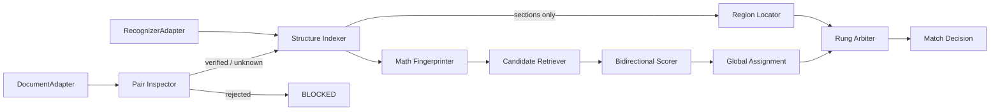

# Find-Engine v2 Product Requirements and Architecture

[中文](Find-Engine_v2_产品需求与架构设计_20260825.md) | [English](Find-Engine_v2_Product_Requirements_and_Architecture_20260825.md)

- Status: Ready for development
- Date: 2026-08-25 (rev. 2)
- Scope: Standalone matching engine and host integration
- Baseline checklist: [Find-Engine_Modification_Checklist_20260825.md](Find-Engine_Modification_Checklist_20260825.md)
- Evidence baseline: [Find-Engine_2023_2025_Comprehensive_Test_Report_20260825.md](Find-Engine_2023_2025_Comprehensive_Test_Report_20260825.md)

> **Revision 2 changes.** A five-rung decision ladder replaces the accept/refuse
> binary (§5A), so that refusing to *answer* no longer means refusing to *help*.
> A pre-refactor safety patch (Phase 0.5) lands the release blockers before the
> architecture work rather than behind it. `FormulaSet` coverage becomes a
> calibrated threshold rather than an absolute, and its dependency on glyph
> geometry is made explicit (FR-05). The bookmark fast path gains an explicit
> preservation requirement (NFR-05). Calibrated probability is demoted from
> decision mechanism to reported metric until the corpus can support it (FR-09),
> with per-rung cost thresholds and split conformal prediction supplying a basis
> the present corpus can support (FR-09.1, FR-09.2). A new §5B governs evidence
> design: which losses are Pareto rather than frontier, the common-mode
> dependency on the text layer, and the independent signals that address it.
> Metrics gain `located_precision`, a risk–coverage curve, and a recoverable /
> irreducible split of the refusal rate (§12.3).

## 1. Product Decision

### 1.1 Decision

**Keep the existing engine and build v2 by preserving the core while refactoring the orchestration layer. Do not rewrite the repository from scratch.**

The test report supports this directly. Every release blocker it found is an
admission-control failure, not a matching failure: the 872 wrong `HIGH`
acceptances on the 2023→2025 cross-year pair were produced by an exact-label
lookup that fired before anything asked whether the two books belonged together.
The similarity machinery was never consulted and is not implicated.

The current code already contains valuable, tested assets:

- hierarchical question-label parsing and normalization;
- PDF outline and body indexing;
- monotonic table-of-contents alignment;
- math-weighted similarity and operator context;
- bounded sequence alignment and explicit refusal results;
- text-quality gates, an OCR seam, and glyph-map recovery;
- 138 existing checks and tools for extracting a real-PDF corpus.

The parts that need replacement or refactoring are concentrated at a clean seam:

- the host directly orchestrates several low-level functions instead of using one matching session;
- document roles and pair identity are not verified before question matching;
- section bookmarks can be classified as question bookmarks;
- the engine has only one way to express uncertainty, and it returns nothing usable;
- local scores are not reconciled through a book-level one-to-one assignment;
- confidence is a rule label, and no reliability evidence is published for it;
- the OCR seam exists, but the host path does not supply a recognizer.

These are orchestration and evidence-combination failures, not reasons to discard the proven parsing and matching implementation. A full rewrite would lose hard-won mathematical-text behavior and recreate the same edge cases.

### 1.2 Rewrite Triggers

Reconsider a rewrite only if one of these becomes true:

1. The new deep-module interface cannot contain the current core without changing the input semantics of more than half of the reusable functions.
2. Formula-structure parsing or global assignment cannot meet the performance target in the current JavaScript runtime.
3. After the P0 work, the fixed mismatch matrix still produces an automatically accepted wrong answer.
4. Existing behavior cannot be migrated to interface-level tests without extensive assertions on internal state.

## 2. Problem Definition

The inputs are one exercise book and one answer key. Either document may:

- have question bookmarks, section-only bookmarks, or no bookmarks;
- have a usable, sparse, corrupt, or scanned text layer;
- contain repeated, missing, or differently nested labels;
- reorder chapters, question types, or individual questions;
- omit questions, add answers, or contain genuinely ambiguous candidates;
- belong to a different year or edition, or be the wrong document role entirely.

Evidence is frequently **asymmetric**. The 2025 pair has a fully bookmarked,
cleanly extracted answer key (573 question bookmarks, 17,658 lines) opposite an
exercise book that is effectively scanned (465 pages, 65 lines, 609 extractable
characters). A design that requires both sides to be strong before it will do
anything is a design that fails this pair completely — and this pair is the
product's near-term target.

The governing product principle is unchanged:

> A wrong match is worse than no match. Recall may improve only when strict precision is preserved.

Revision 2 adds one clarification and makes it load-bearing:

> Refusing to *answer* must not mean refusing to *help*. Whatever the engine has
> established — a chapter, a page range, a short candidate list — is returned at
> a rung that cannot be mistaken for an answer.

## 3. Goals and Non-goals

### 3.1 Goals

1. Preserve 100% precision and recall on the verified 2023 pair with question bookmarks, **at its current sub-millisecond latency**.
2. Reject cross-year pairs, two-answer pairs, two-exercise pairs, and answer-to-exercise pairs at document level.
3. Distinguish books, sections, question types, and actual questions.
4. Improve strict precision and recall without bookmarks through mathematical structure and global constraints.
5. Support reordered answer keys, missing items, extra items, and non-monotonic order.
6. Return explainable, graded results with a first-class right to refuse **and a first-class right to locate without answering**.
7. Remain local-first; inject PDF reading and OCR through adapters.
8. Use the same core for single-question lookup and whole-book evaluation.

### 3.2 Non-goals

- The engine does not judge whether a mathematical solution is correct.
- A generative model is not a required dependency.
- The first release will not support every language, subject, or numbering convention.
- Host interactions such as tapping or manual binding must not hide engine errors.
- Confidence must not be increased by simply raising scores or loosening thresholds.
- Coverage is never recovered by lowering the automatic-acceptance bar. It is recovered by returning a lower rung, never by promoting weak evidence.

## 4. Primary Use Cases

### 4.1 Single-question lookup

The caller supplies a page, region, or extracted question. The engine returns one rung of the decision ladder (§5A).

### 4.2 Whole-book mapping

The engine builds a full exercise-to-answer mapping for caching, offline evaluation, and regression testing.

### 4.3 Wrong books and same-role documents

The engine blocks the pair before per-question matching begins, and names the contradiction.

### 4.4 No bookmarks and reordered answers

The engine does not assume matching order. Position is used only after strong anchors show that it is reliable.

### 4.5 Scanned exercise book, readable answer key

The engine cannot identify the question and says so. It still returns the answer
key's chapter or section range for the page in view, because the answer key's
structure is intact and wholly independent of the exercise book's text layer.

---

## 5A. The Decision Ladder

The central structural change in revision 2. The previous design had one way to
express uncertainty and it returned nothing usable, which forced a false choice
between accuracy and coverage. The ladder separates *what the engine is willing
to assert* from *what it managed to establish*.

| Rung | Meaning | Shown to the user as | Can be wrong the way a match can be wrong? |
|---|---|---|---|
| `AUTO_MATCH` | One answer, engine-authorized | The answer | **Yes** — this is the rung the safety work protects |
| `REVIEW` | A small ranked candidate set; the user chooses | A short list with page numbers | No — it asserts no choice |
| `LOCATED` | Question not identified, but the answer region was bounded | "Answers for this section are on pages X–Y" | No — it asserts a range, not an identity |
| `REFUSED` | Evidence insufficient or self-contradictory | The reason, and what would fix it | No |
| `BLOCKED` | The pair is invalid; the engine will not operate on it | The contradiction, and the document it expected | No |

Three rules govern the ladder:

1. **A rung is a ceiling, not a target.** No component may promote a result to a higher rung in order to improve a coverage metric.
2. **Lower rungs carry their evidence.** `REVIEW` returns candidate labels and pages. `LOCATED` returns the section path, the page range, and the alignment that produced it. `REFUSED` returns a reason code and the missing input.
3. **Only `AUTO_MATCH` counts in `strict_precision`.** `REVIEW` and `LOCATED` are scored on separate metrics (§12.3), so improving them can never disguise a precision regression.

### 5A.1 Pair status determines the available rungs

This is what prevents document-level gating from degenerating into blanket rejection.

| Pair status | `AUTO_MATCH` | `REVIEW` | `LOCATED` | Rationale |
|---|---|---|---|---|
| `VERIFIED_PAIR` | permitted | permitted | permitted | Identity established by content anchors |
| `UNKNOWN_PAIR` | **forbidden** | permitted | permitted | Cannot authorize an answer; can still navigate |
| `REJECTED_PAIR` | forbidden | forbidden | forbidden | `BLOCKED` — a contradiction was found |

`UNKNOWN_PAIR` is the normal state for the 2025 pair until OCR is connected, and
it must remain a *working* state. Blocking it would delete the product's coverage
on its main new book in exchange for safety the `AUTO_MATCH` ban already provides.

### 5A.2 What the ladder recovers, from the measured data

| Situation in the test report | Today | Under the ladder |
|---|---|---|
| Answer key without bookmarks: 858 of 872 refused | Nothing returned | `LOCATED` from the surviving TOC alignment for most of the 858 |
| 2025 exercise book, 18 chapter bookmarks | 479 wrong `HIGH` acceptances | Sections correctly typed; chapter-level `LOCATED` across all 465 pages |
| Duplicate label, no section alignment | `NONE`, with candidates already attached to the result | `REVIEW` — which is what those attached candidates were always for |

The 2025 row deserves emphasis. The same 18 bookmarks that are currently the
engine's single largest source of wrong answers become, once typed correctly, its
single largest source of safe coverage on that book. No new signal is required —
only the correct classification of one that is already parsed.

### 5A.3 Where refusal happens in the pipeline

Refusal is an **admission gate, not a verdict**. Role and pair checks run before
indexing, cost milliseconds, and return a specific reason code. Running the full
pipeline in order to refuse at the end is rejected on three grounds: it pays full
latency for a null result, it computes evidence it then discards, and a long
pipeline gives the engine repeated opportunities to talk itself into a match.

Scheduling is a separate matter. The recognizer arrives late (Phase 6) while the
gates arrive early (Phase 0.5), so for several phases the 2025 pair will
correctly refuse `AUTO_MATCH` where it currently answers wrongly. §11.1 states
that consequence explicitly so it is chosen rather than discovered.

---

## 5B. Evidence Design

Precision and coverage move together when new evidence is **independent** of
existing evidence, and trade against each other only when a threshold is moved on
a fixed evidence base. Most of the current losses are of the first kind, which is
why the P0 work is not a balance question at all (§5B.1). This section governs
what evidence the engine is built on and how new evidence is justified.

### 5B.1 Defects are Pareto losses, not frontier positions

Three of the measured failures cost precision and coverage simultaneously, from
one root cause each:

| Defect | Precision loss | Coverage loss |
|---|---|---|
| Sections typed as questions (FR-03) | 479 wrong `HIGH` acceptances | 573 real questions unaddressable |
| Body parser over-extraction | 188 unconfirmed acceptances (74.3% strict) | Spurious entries consume top-K budget and force real questions into alignment gaps |
| Alignment deadline reached (NFR-02) | Results produced by expiry are arbitrary | Questions that would have resolved never get the chance |

Fixing each improves both axes. No threshold is involved. Work that trades
precision for coverage is not scheduled until these are closed.

### 5B.2 Common-mode dependency is the structural weakness

The confidence model rests on "how many independent signals agree." Auditing
what is actually independent:

| Signal | Depends on text layer? | Depends on book parallelism? |
|---|---|---|
| Bookmark identifier | No | No |
| TOC alignment | Partially (title text) | No |
| Content similarity | **Yes** | No |
| Operator context / formula structure | **Yes** | No |
| Positional prior (disabled) | No | **Yes** |

Three of five signals route through the text layer. That is a common-mode
dependency, and it is why a scanned exercise book loses nearly its whole evidence
base at once rather than degrading. **The highest-value new evidence is any
signal that does not pass through the text layer.**

### 5B.3 Independent signals

Each must be prototyped and measured before it is designed in; none may be
adopted on plausibility.

**The book's own printed contents — implemented and measured.** A document with
no bookmark tree still prints a table of contents, and that contents is the
label-to-location map the bookmarks would have supplied. It is independent of
similarity entirely and depends on the text layer only for two structural reads.

The obstacle is that a contents row gives a *printed* page, offset from the PDF
page index by the front matter. The offset is recovered rather than guessed:
every label appearing in both the contents and the body parse votes on
`pdfPage − printedPage`, and the mode is the offset. Measured on the 2023 answer
key, 492 of 508 labels vote +18 — a 96.9% mode, obtained with no ground truth.

Applying that offset to all 508 labels would place 492 correctly and 16 wrongly.
Sixteen confident wrong answers is not an acceptable price, and it does not have
to be paid: the 16 failures are exactly the labels where the contents and the
body parse disagree, so they are identifiable in advance. Emitting a location
only where the two independent readings agree yields **492 locations at 100%
precision**, and takes the no-answer-bookmarks regime from 8 resolved questions
to 490 while per-page p95 falls from 204 ms to 1 ms — the structural
short-circuit resolves without any content comparison.

This is §5B.2's rule paying out: the signal is strong because it does not route
through similarity, and it is safe because two readings that disagree are a
refusal rather than a tie to be broken. See `src/contents-index.js`.

**Rendered-formula perceptual hashing (highest remaining value).** Two formulas can be
compared without being read. Render the exercise-side region and the candidate
answer-side region through the existing PDF adapter and compare image features.
For a matched exercise/answer pair from one publisher, the same expression is
typeset by the same engine in the same fonts, so rendered crops should be
near-identical up to scale. This signal is independent of the text layer, needs
no recognizer model, **works on scanned input**, and fails safe: low similarity
yields no evidence and a lower rung. It attacks the one case that currently has
no signal at all, at a fraction of OCR's cost. See the Phase 3 prototype gate
(§11.3).

**Per-section cardinality.** If exercise section 1.2 contains *n* questions and
the answer key's aligned section contains *n* entries, that agreement is
structural evidence touching neither content nor order. A large mismatch is
evidence against the section alignment itself.

**Span-length correlation.** Long questions have long answers. This is the
length half of Gale–Church applied to span extent rather than ordinal position,
and unlike the positional prior it does not assume the two books are parallel —
which is precisely why the positional prior was rejected (§7.1 of the research
report).

### 5B.4 Rule

A new signal is admitted only if it (a) is independent of at least one existing
signal in the §5B.2 sense, (b) has a measured margin on the real corpus, and
(c) can detect its own inapplicability. Condition (c) is what the positional
prior failed, and it is not waived for a signal that performs well where it
applies.

---

## 5. Functional Requirements

### FR-01 Document-role classification

- The left document must be `EXERCISE`; the right document must be `ANSWER`.
- **Both sides are checked.** The current one-sided check is why all two-answer pairs pass and two-exercise pairs are rejected only by accident.
- `UNKNOWN` roles cannot enter automatic per-question matching. They may still reach `LOCATED`.
- Evidence includes filename, cover title, outline vocabulary, and body structure.
- Caller-supplied roles are evidence, not permission to override a strong contradiction.
- Reason codes: `LEFT_ROLE_INVALID`, `RIGHT_ROLE_INVALID`.

### FR-02 Pair-identity verification

- Build a book fingerprint from year, normalized title, subject, edition, section structure, label distribution, and sampled content anchors.
- Explicit year or subject conflicts return `REJECTED_PAIR`.
- Insufficient evidence returns `UNKNOWN_PAIR` — never an implicit approval, and never a `BLOCKED` result either. See §5A.1.
- An exact unique label is strong evidence only inside a `VERIFIED_PAIR`.
- Alphabet overlap establishes text comparability, not book identity. The wrong 2023-question/2025-answer pair reached 0.9638 overlap; for two Chinese mathematics books that measures only that their text is mutually decodable.

**Content anchors, defined.** This phrase carries the whole weight of FR-02 and
is specified here rather than left to implementation. Sample *k* labels present
in both documents (target k = 24, stratified across the label range). For each,
score the exercise-side text against the answer-side text using the **existing**
`contentSimilarity`. A `VERIFIED_PAIR` requires the median top-two margin across
the sample to exceed a calibrated threshold. This deliberately reuses proven
machinery: it is the one identity signal for which the repository already has
measured behavior — on the 2023 pair it ranks the correct answer first in 95.5%
of cases, where the alphabet check cannot separate the pair at all.

**Asymmetric evidence.** Verification must not require both sides to be readable.
When one document is `SCANNED` or `SPARSE_LAYER`, content anchors cannot be
sampled from it; the pair stays `UNKNOWN_PAIR` and operates under §5A.1
permissions rather than being blocked. Once OCR is connected, anchors are sampled
from recognized text and the pair may be promoted to `VERIFIED_PAIR`, subject to
the OCR confidence cap in FR-09.

- Reason codes: `PAIR_IDENTITY_MISMATCH`, `PAIR_IDENTITY_UNKNOWN`.

### FR-03 Structural indexing

- Classify each outline node as `BOOK`, `SECTION`, `QUESTION_TYPE`, `QUESTION`, or `UNKNOWN`.
- Titles such as `1.2 Single-variable differential calculus` and `2.7 Linear transformations` must classify as `SECTION`. On the fixed regression matrix, zero such titles may enter the question index.
- Prefer explicit markers (`例题`, `习题`, `Example`, `Exercise`, `Problem`) where present. The current deepest-depth heuristic becomes a fallback, not the primary test.
- Classification also uses depth, child count, page span, label density, and sequence continuity. A node spanning dozens of pages cannot represent one question.
- Only reliable question-level bookmarks may bypass body/OCR question detection.
- **Sections are retained, not discarded.** A node classified `SECTION` is the primary input to `LOCATED`. Misclassifying sections as questions is the defect; deleting them would forfeit the fix.
- Reason code: `NO_QUESTION_LEVEL_INDEX` — which permits `LOCATED`, never `BLOCKED`.

### FR-04 Text quality and OCR

- Quality gains text-page coverage, characters per page, and coverage uniformity, alongside the current character-class ratios.
- The 2025 exercise book — 465 pages, 65 lines, 609 characters — must classify as `SCANNED` or `SPARSE_LAYER`. The presence of section bookmarks must not exempt it.
- A recognizer is injected through an adapter and may OCR pages or regions on demand, with caching.
- Without a recognizer, scanned input returns `OCR_REQUIRED` and no `AUTO_MATCH`. It may still return `LOCATED` from outline structure, which requires no text at all.
- OCR output passes the same structural and pair-identity gates as extracted text, and carries the FR-09 confidence cap.
- Reason code: `OCR_REQUIRED`.

### FR-05 Mathematical fingerprints

- Preserve current normalization, math fragments, and operator context.
- Add formula structure: operators, operands, grouping, scripts, bounds, and matrix shape.
- Produce stable fingerprints with explainable structural differences.
- Determine the complete boundary of one question first, then extract every complete mathematical expression inside that boundary into a `FormulaSet` that preserves multiplicity, order, and location.
- "Complete" includes the expression's full grouping, fractions, radicals, scripts, integral and limit bounds, and matrix shape. Truncated or unrecoverable output is marked `INCOMPLETE_FORMULA` and never silently completed.

**Coverage is a calibrated threshold, not an absolute.** An earlier draft
required *every* expression in the question's `FormulaSet` to have a compatible
counterpart in the candidate answer. That inverts a documented property of this
corpus: an answer entry frequently gives only the result, so a three-expression
question whose answer restates none of them would fail the gate. A conjunctive
requirement over an unbounded set drives recall toward zero on precisely the case
the engine exists to serve. The requirement is therefore:

- `AUTO_MATCH` requires `FormulaSet` coverage at or above a calibrated threshold θ **and** zero strong structural conflicts. θ is fitted per FR-09 and reported, with 1.0 as the starting value to be relaxed only against measured precision.
- A **strong structural conflict** — mismatched exponent, sign, integral or limit bound, or matrix element between two otherwise corresponding expressions — caps the result at `REVIEW` regardless of coverage. Conflicting evidence is treated more seriously than missing evidence.
- Incomplete extraction caps the result at `REVIEW` or `REFUSED`. It never produces a guessed completion.
- Operator-local character context is secondary disambiguation only. It is consulted after a complete expression has matched, cannot trigger a match alone, and cannot promote a candidate with a missing, truncated, or conflicting formula. **The window radius is a calibrated parameter, not a fixed requirement** — the current value of 3 was swept against the present character representation and must be re-swept when formula structure replaces it.

**Adapter dependency, made explicit.** Superscript, subscript, fraction bar, and
matrix layout are *geometric* facts. The current `DocumentAdapter` returns
`{page, text}` lines and discards position, so FR-05 cannot be satisfied through
it. One of two decisions must be made before Phase 3 begins:

- **(a)** extend `DocumentAdapter` to expose positioned glyph runs — which changes the corpus format, `tools/extract-corpus.mjs`, and every stored fixture; or
- **(b)** scope FR-05 to structure recoverable from linear text — bracket depth, operator sequence, fragment multiplicity — and accept a smaller structural vocabulary.

Option (a) is preferred on capability grounds and is the larger cost. This
decision is a Phase 3 entry gate, not an implementation detail.

### FR-06 Candidate retrieval

- Build inverted indexes for labels, sections, formula structures, and keywords.
- Generate a bounded top-K candidate set per question.
- Do not discard a strong content match merely because order differs.
- Return an empty set when evidence is insufficient or contradictory — which routes to `LOCATED` where a region is known, and `REFUSED` where it is not.

### FR-07 Bidirectional consistency

- If exercise A selects answer B, verify that answer B also selects exercise A.
- Mutual best matches strengthen evidence.
- A forward-only match with a reverse conflict cannot reach `AUTO_MATCH`. It caps at `REVIEW`.

### FR-08 Global one-to-one assignment

**Scope.** This requirement governs `matchAll` only. In `matchQuestion` there is
no global problem to solve, and the guarantees below do not apply. Any claim that
depends on global assignment must state which mode it holds in.

- One answer may be assigned to at most one question, measured **per unique question**, not per page. A multi-page question accepted on each page it spans is one assignment, not several (§12.3).
- Missing exercises and unused answers are valid outcomes.
- Reordered answers are supported.
- Estimate order reliability from strong anchors. Use order as a soft score only when reliable; disable hard position constraints when it is not.
- High-confidence assignments may be committed; lower-confidence assignments remain reversible.
- Never delete records from immutable indexes; manage state with an assignment map and an availability mask.

**Solver and bound.** Rectangular assignment with gap costs, solved by the
Jonker–Volgenant variant of the Hungarian algorithm over the sparse top-K
candidate graph — not the dense matrix. At 573 questions with K = 16 the graph
has ~9×10³ edges. Target: whole-book assignment under 3 s on desktop and under
15 s on the target tablet, measured, with section partitioning as the fallback if
either bound is missed.

### FR-09 Confidence and refusal

- Return one rung of §5A with an ordinal confidence band.
- Evidence includes top-two margin, bidirectional consistency, assignment replacement cost, `FormulaSet` coverage, and perturbation stability.
- Strong conflicts cap the rung. Unknown pair identity, unknown structure, or OCR-sourced text impose hard caps.
- A `LOW` band is never displayed as a final answer. It is a `REVIEW` candidate.

**Calibration is reported, not load-bearing — for now.** Fitting a 0..1
probability requires book-level splits (§10.2), and the corpus currently supports
one complete pair plus one half-pair whose exercise side is scanned. A
probability fitted on one training book and evaluated on one book is a curve
through noise, and shipping it would repeat the failure documented in the
positional-prior negative result: a signal presenting more confidence than its
evidence base supports. Therefore:

- The **decision mechanism** remains ordinal bands derived from how many independent signals agree — the property that currently yields zero wrong matches.
- A **reliability curve** (observed correctness per band) is computed and published from Phase 5 onward as a reported metric.
- Calibrated thresholds replace ordinal bands only when at least **six** independent book pairs are available for split training, calibration, and blind evaluation. Until then, §13 P1's confidence gate is met by the reliability curve, not by a fitted probability.

#### FR-09.1 One threshold per rung, derived from that rung's cost

The engine does not have one operating point. It has one per rung, because being
wrong costs a different amount at each. Under the classical abstention result,
with a wrong answer costing *C* times an abstention, accept when
`P(correct) > 1 − 1/C`.

| Rung | What being wrong costs the user | Working *C* | Implied threshold |
|---|---|---|---|
| `AUTO_MATCH` | Believes a wrong solution; downstream work is confidently wrong | ~100 | ~0.99 |
| `REVIEW` | Scans a short list, finds nothing, falls back | ~10 | ~0.90 |
| `LOCATED` | Flips to the wrong section and turns a few pages | ~3 | ~0.67 |

*C* is a product input, not an engineering constant. Each value must be recorded
with the person who set it and revisited when the host UI changes what a rung
looks like. The point of the table is structural: **one score, several
thresholds, each justified by a stated cost** — not a single global cutoff
applied to heterogeneous evidence.

#### FR-09.2 Set-valued decisions by split conformal prediction

Split conformal prediction gives a distribution-free guarantee — the truth lies
in the returned candidate set with probability at least 1 − α — from a
calibration set of order one hundred examples rather than six books. It therefore
supplies the rung ladder with a principled basis that the corpus can actually
support today, while FR-09's fitted-probability path remains blocked.

- Compute a nonconformity score per candidate from the fused evidence.
- Calibrate the quantile on a held-out split of the **exercise-side** questions of a book not used to set any other threshold.
- Emit the prediction set, and map it to a rung: size 1 → `AUTO_MATCH`; size 2–5 → `REVIEW`; larger but region-bounded → `LOCATED`; unbounded → `REFUSED`.
- α is chosen from the §FR-09.1 cost ratio for the rung being authorized.

**Stated limit.** The conformal guarantee is *marginal* — averaged over the
calibration distribution — not conditional on an individual question, and it
assumes exchangeability, which a new publisher or a new typesetting convention
breaks. It is a guarantee about the corpus it was calibrated on. It is adopted
because it is strictly better founded than an uncalibrated cutoff and because it
degrades visibly rather than silently, not because it is unconditional.

### FR-10 Stability checks

- Re-run decisions under alternative normalization, OCR candidates, and small input perturbations.
- Stable candidates may hold their rung; they are not promoted for stability alone.
- Candidates that change under small perturbations drop to `REVIEW` or `REFUSED`.

### FR-11 Diagnostics

- Return semantic reason codes from the standard set: `LEFT_ROLE_INVALID`, `RIGHT_ROLE_INVALID`, `PAIR_IDENTITY_MISMATCH`, `PAIR_IDENTITY_UNKNOWN`, `OCR_REQUIRED`, `NO_QUESTION_LEVEL_INDEX`, `INCOMPLETE_FORMULA`, `STRUCTURAL_CONFLICT`, `AMBIGUOUS_LABEL`, `REVERSE_CONFLICT`, `TIMEOUT`.
- Return only the evidence and candidate-location summaries needed to diagnose a result.
- Do not log complete copyrighted question text.
- The same input, engine version, and configuration must produce deterministic results.

## 6. Non-functional Requirements

### NFR-01 Safety

- The fixed mismatch matrix must contain zero `AUTO_MATCH` results.
- Unidentifiable accepted results count against strict precision (§12.3).
- Timeout, cancellation, and adapter failure must fail closed — to `REFUSED`, or to `LOCATED` where a region was already established before the failure.

### NFR-02 Performance

- Index each document once and cache the result.
- Match one question against sparse top-K candidates, not the whole answer key.
- Desktop single-question p95 target: under 150 ms, excluding first-time OCR.
- **The timeout must not be load-bearing.** The current no-exercise-bookmark path shows a 1,534.6 ms maximum against a ~1,500 ms alignment deadline, which means results in that regime are being produced by expiry rather than by decision. Post-Phase-3, no regime may have a maximum within 20% of the deadline, and timeout count is a published metric.
- Whole-book assignment: see FR-08 bounds.
- Keep immutable indexes and a small assignment map in memory; do not duplicate complete body text.

### NFR-03 Privacy and offline behavior

- No network is required by default.
- PDFs, OCR output, question text, and book fingerprints remain local.
- Any optional remote adapter must be explicitly enabled by the host.

### NFR-04 Testability

- Callers and tests use the same external seam.
- Behavioral tests assert decisions and evidence, not internal arrays or algorithm steps.
- The production PDF adapter, corpus adapter, and recognizer fake satisfy the same interfaces.
- **Pure-function unit tests are permanent.** `normalizeForMatch`, `normalizeId`, `compareIds`, `symbolContexts`, `assessTextQuality`, and the glyph learner keep their direct tests. They are cheap, they localize regressions that interface-level tests only detect, and §12.1's deletion policy does not reach them.

### NFR-05 Fast-path preservation

The 2023 bookmarked configuration currently resolves 508/508 at p95 0.017 ms
because a unique exact label short-circuits before any similarity is computed.
FR-07, FR-08, and FR-10 would each, unmodified, place work on that path.

- Inside a `VERIFIED_PAIR`, a unique exact label with no reverse conflict short-circuits to `AUTO_MATCH` without candidate retrieval, global assignment, or perturbation checks.
- The 2023 bookmarked baseline is locked: 508/508 unique recall, 100% strict precision, **p95 under 1 ms**, enforced as a regression test from Phase 0 onward.
- Any phase that raises this p95 above 1 ms has regressed and does not exit.

---

## 7. Target Architecture

### 7.1 External deep module

Create one `MatchingEngine` deep module. Its interface stays small while document verification, structural parsing, fingerprints, retrieval, assignment, and calibration remain inside the implementation.

```js
const prepared = await MatchingEngine.preparePair({
  exerciseDocument,
  answerDocument,
  recognizer,
  options,
});

// BLOCKED pairs stop here. UNKNOWN pairs continue with AUTO_MATCH disabled.
if (prepared.status === 'REJECTED_PAIR') return prepared.rejection;

const decision = await prepared.session.matchQuestion(target);
const bookResult = await prepared.session.matchAll();
```

External interface:

```text
preparePair(input) -> PairPrepared | PairRejected
PairSession.matchQuestion(target) -> MatchDecision
PairSession.matchAll(options?) -> BookMatchResult
```

`PairPrepared` carries `pairStatus` and the resulting rung permissions (§5A.1),
so the host can render the right affordance without inspecting internals. The
interface does not expose stages, weights, dynamic-programming matrices, or cache
shapes.

### 7.2 Adapter seams

Formalize the current document contract as `DocumentAdapter`:

- production adapter: pdf.js document;
- test adapter: in-memory copyrighted-corpus record.

Define `RecognizerAdapter`:

- production adapter: local OCR;
- test adapter: deterministic fake / OCR fixture.

Both seams have at least two justified adapters. Formula parsing, candidate
retrieval, assignment, and calibration remain internal seams rather than public
interfaces. **`DocumentAdapter`'s shape is contingent on the FR-05 decision** —
if option (a) is taken, it must expose positioned glyph runs, and the corpus
format changes with it.

### 7.3 Internal modules



- **Pair Inspector**: roles, year, title, sections, and content anchors. Emits `pairStatus` and rung permissions.
- **Structure Indexer**: section/type/question classification, quality, and OCR scheduling.
- **Region Locator**: turns section classification and TOC alignment into bounded answer regions. This is the `LOCATED` path and it does not depend on the text layer.
- **Math Fingerprinter**: current character signals plus formula structure.
- **Candidate Retriever**: inverted indexes and sparse top-K candidates.
- **Bidirectional Scorer**: forward/reverse matching and evidence fusion.
- **Global Assignment**: one-to-one mapping, gaps, reorder, reversible state. `matchAll` only.
- **Rung Arbiter**: applies caps and permissions to produce the final rung. The single place where a result's rung is decided.
- **Match Decision**: stable, explainable, rejectable external result.

## 8. Core Data Contracts

### 8.1 PairDecision

```text
status: VERIFIED_PAIR | UNKNOWN_PAIR | REJECTED_PAIR
exerciseRole: EXERCISE | ANSWER | UNKNOWN
answerRole: EXERCISE | ANSWER | UNKNOWN
permittedRungs: ('AUTO_MATCH' | 'REVIEW' | 'LOCATED')[]
reasonCodes: string[]
evidenceSummary: object
```

### 8.2 QuestionRecord / AnswerRecord

```text
id: stable internal id
label: normalized hierarchical label | null
kind: SECTION | QUESTION_TYPE | QUESTION | UNKNOWN
pageRange: [from, to]
sectionPath: string[]
textFingerprint: object
mathFingerprint: object
source: OUTLINE | TEXT | OCR
quality: object
```

### 8.3 MatchDecision

```text
status: AUTO_MATCH | REVIEW | LOCATED | REFUSED | BLOCKED
band: HIGH | MEDIUM | LOW | NONE
reliability: observed correctness for this band | null
answerLocation: page/range | null
region: { sectionPath, from, to } | null      // populated for LOCATED
cappedBy: reason code | null                  // why the rung is not higher
reasonCodes: string[]
evidence: {
  pairVerified,
  labelAgreement,
  formulaCoverage,
  structuralConflicts,
  operatorContextSimilarity,
  bidirectionalAgreement,
  assignmentStability,
  topTwoMargin
}
candidates: diagnostic summaries[]
```

`cappedBy` is required whenever the rung is below `AUTO_MATCH`. A result that
cannot say why it was capped is a result whose reasoning was not recorded.

## 9. Algorithm Flow

1. **Admit or block.** `preparePair` verifies both document roles, then verifies pair identity from title, year, edition, subject, outline structure, and sampled content anchors. A contradiction returns `BLOCKED` immediately, before any indexing. Insufficient evidence returns `UNKNOWN_PAIR` with `AUTO_MATCH` withheld and the session continuing.
2. Build one immutable answer-book index, separating sections from real answers. OCR pages or regions on demand through the recognizer and cache the result.
3. **Establish the region first.** From section classification and TOC alignment, bound the answer region for the page in view. This costs no text and no similarity, and it is the floor beneath every later step: if everything after this fails, the result is `LOCATED` rather than nothing.
4. In single-question mode, determine the question boundary from the user's click or an explicit question ID and read only that region. In full-book mode, process exercises from the first onward without irreversible greedy commitment.
5. **Fast path.** Inside a `VERIFIED_PAIR`, a unique exact label with no reverse conflict returns `AUTO_MATCH` here (NFR-05). Steps 6–12 do not run.
6. Extract the label, section, keywords, and every complete mathematical expression in the current question into an ordered `FormulaSet`. Mark incomplete boundaries or OCR output as explicit risk.
7. Apply role, pair-identity, label, section, and inverted-index filters before generating a bounded top-K candidate set. Do not drop a strong content candidate merely because answer order differs.
8. Require `FormulaSet` coverage at or above θ with no strong structural conflict. Only then consult operator-local context as secondary disambiguation.
9. Score exercise-to-answer and answer-to-exercise directions. A reverse conflict caps at `REVIEW`.
10. Estimate order reliability from high-confidence anchors. Use a local window for speed when order is reliable; disable hard position constraints when it is not.
11. In `matchAll` only: solve global one-to-one assignment allowing gaps, missing items, extra items, and reordering. Commit high-confidence assignments to an occupied set; keep the rest provisional and reversible. Never delete records from source indexes.
12. Run perturbation stability checks over candidates, formula parsing, and OCR output.
13. **Arbitrate the rung.** Apply pair permissions (§5A.1) and every cap, record `cappedBy`, and return. Incomplete formulas, conflicting evidence, an insufficient top-two margin, or unknown pair identity cannot produce `AUTO_MATCH` — but where step 3 established a region, they return `LOCATED`, not nothing.

## 10. Confidence Design

### 10.1 Principles

- Raw similarity is not probability.
- Confidence rises only when independent evidence agrees.
- Conflicting evidence is more serious than missing evidence.
- Unknown pair identity, unknown structure, or OCR-sourced text imposes a hard cap.
- Thresholds come from held-out books, not from the current corpus alone.
- A confidence mechanism that cannot be validated on held-out books is not shipped as a decision mechanism (FR-09).

### 10.2 Calibration data

Positive examples are verified question-answer pairs.

Hard negatives include:

- identical labels from different years;
- **adjacent editions of the same book, same subject, same publisher** — the near-miss case, which is what FR-02 will actually be judged on;
- different questions in the same section;
- formulas differing by exponent, sign, bounds, or matrix element;
- two-answer, two-exercise, and answer-to-exercise pairs;
- section labels that collide with question labels;
- reordered, missing, and extra items;
- OCR substitutions, missing glyphs, broken lines, and formula variants.

Split training, calibration, and blind evaluation **by book**, never by randomly
selected questions from the same book. The corpus does not yet support this at
the required width; see FR-09 for what ships in the meantime and what unlocks
the change.

## 11. Development Phases

### 11.0 Phase 0: Freeze the evidence baseline

- Keep all 138 current checks.
- Freeze the current 2023/2025 whole-book measurements from the test report.
- Add red tests for cross-year pairs, two-answer pairs, two-exercise pairs, and section misclassification.
- Lock the NFR-05 fast-path baseline as a regression test.
- Report strict precision, unique recall, refusal rate, `LOCATED` rate, and performance.

Exit: every known defect reproduces reliably and the new tests fail first.

### 11.05 Phase 0.5: Safety patch — before the refactor

The three release blockers are live in production today and none of them requires
the architecture. The role check is a predicate on two documents; the identity
check is a fingerprint comparison plus a content-anchor sample; the sparse-layer
check is a threshold in the existing quality gate. Gating these behind a
whole-repository refactor leaves 872 wrong `HIGH` acceptances in the field for
the duration of Phase 1.

- Two-sided role gate at the existing host entry point.
- Pair identity with `VERIFIED` / `UNKNOWN` / `REJECTED`, blocking `HIGH` outside `VERIFIED`.
- Sparse-layer detection returning `OCR_REQUIRED`.
- Section-versus-question classification for outline nodes.

Exit: the fixed mismatch matrix reports accepted = 0 and `HIGH` = 0; 2025 without
OCR reports accepted = 0; the 2023 bookmarked baseline is unchanged. This is a
shippable increment on the current architecture, and it is expected to reduce
coverage on 2025 to near zero — which Phase 2 then restores via `LOCATED`.

### 11.1 Phase 1: Establish the MatchingEngine seam

- Add `preparePair`, `matchQuestion`, and `matchAll`.
- Wrap the current document interface in adapters.
- Move current behavior, including the Phase 0.5 gates, behind the deep module before changing results.
- Make the host call only the new interface.

Exit: all 138 tests pass; the Phase 0.5 matrix results are unchanged; the host no longer orchestrates low-level matching functions.

**Product consequence, stated deliberately.** From Phase 0.5 until the recognizer
lands in Phase 6, the 2025 pair is supported by correct refusal and — from Phase
2 — by chapter-level `LOCATED` navigation. It has no `AUTO_MATCH` coverage in
that window. This is a real improvement in safety and a real reduction in
apparent coverage relative to today's wrong answers. It is chosen, not
discovered.

### 11.2 Phase 2: Rung ladder and region location

- Implement the five-rung ladder and the Rung Arbiter.
- Implement the Region Locator over section classification and TOC alignment.
- Route the previously-empty refusals to `LOCATED` and `REVIEW` where evidence permits.
- Host renders each rung distinguishably.

Exit: on the answer-key-without-bookmarks regime, `LOCATED` covers the majority
of the 858 previously-empty refusals with zero `AUTO_MATCH` regressions; 2025
reports chapter-level `LOCATED` across its page range at zero wrong answers.

### 11.3 Phase 3: Formula structure and sparse retrieval

- **Prototype gate, run first:** measure rendered-formula perceptual hashing (§5B.3) on the real corpus before committing to the adapter work. Report the discrimination margin between correct and best-wrong candidates, and the margin on a scanned-side pair. If the signal carries, it changes what this phase needs to build — it supplies text-layer-independent evidence that formula structure parsing was intended to supply, at materially lower cost.
- **Entry gate:** the FR-05 adapter decision — (a) positioned glyph runs, or (b) reduced structural vocabulary — is made and recorded, informed by the prototype result.
- Formula structure representation; current operator context retained as a compatibility feature.
- Inverted indexes and top-K candidates.
- Explainable structural differences.

Exit: no new automatic errors on hard formula negatives; single-question p95 meets target; no regime's maximum latency sits within 20% of the alignment deadline; the prototype result is recorded whether it succeeded or failed.

### 11.4 Phase 4: Bidirectional consistency and global assignment

- Mutual-best checks.
- One-to-one mapping with gaps and reorder, per unique question.
- Committed / tentative / reversible state.
- Adaptive order reliability.

Exit: reorder, missing-item, and extra-item tests pass; an answer is never automatically assigned twice; NFR-05 fast-path p95 is unchanged.

### 11.5 Phase 5: Reliability evidence and stability

- Build book-level splits as far as the corpus allows.
- Publish the reliability curve per ordinal band.
- Add input-perturbation checks.
- Set rung thresholds from measured reliability.

Exit: every ordinal band has a published observed-correctness figure; all fixed hard negatives are rejected. Calibrated probability replaces ordinal bands only at the FR-09 corpus width.

### 11.6 Phase 6: Host integration and staged rollout

- Production OCR adapter.
- Caching and cancellation.
- Run v2 in read-only shadow mode against v1.
- Switch only after acceptance, with a fast rollback flag.

Exit: device testing validates integration and performance, not core correctness.

## 12. Test Strategy

### 12.1 Interface-level tests

New tests cross the `MatchingEngine` external seam and assert:

- pair decision and permitted rungs;
- match decision, rung, and `cappedBy`;
- whole-book assignment;
- semantic reason codes;
- performance and cancellation.

Old shallow-module tests are deleted only after the same behavior is fully covered
through the deep interface — **excluding** the pure-function tests protected by
NFR-04, which are permanent.

### 12.2 Fixed regression matrix

- 2023 Q→A in all four bookmark regimes.
- 2025 Q→A in all four bookmark regimes.
- Q23→A25 and Q25→A23.
- A23→A23, A25→A25, A23→A25, A25→A23.
- All Q/Q and A/Q combinations.
- **Near-miss pair:** same publisher, same subject, adjacent edition, overlapping label space. Synthesize by perturbing a fingerprint if no such pair is available. This is the case FR-02 is actually judged on; 2023-versus-2025 is easy by comparison.
- Identical, locally reordered, and fully reordered answer keys.
- Missing items, extra items, and repeated labels.
- Scanned input without OCR, with OCR, and with OCR noise.
- **No page sampling.** No-bookmark regimes run over complete books; the every-8th and every-16th-page sampling in the current suite is retired.

### 12.3 Metrics

**Unit of decision.** Metrics are denominated **per unique question**, not per
page. The current 872-accepted-for-508-questions figure counts multi-page
questions once per page they span, which is not the user-facing event and inflates
both numerator and denominator. Per-page counts remain available as a diagnostic.

- `strict_precision = verified_correct_auto_match / auto_match_total` — `AUTO_MATCH` only;
- `unique_recall = distinct_correct / gold_questions`;
- `located_coverage = questions_with_bounded_region / gold_questions`;
- `located_precision = regions_containing_the_true_answer / regions_returned`;
- `review_hit_rate = reviews_whose_candidate_set_contains_truth / review_total`;
- document rejection rate;
- number of wrong `AUTO_MATCH` decisions;
- p50, p95, max, and **timeout count**;
- reliability per ordinal band, and top-two margin distribution.

`located_coverage` and `review_hit_rate` are the coverage metrics. They are
reported beside strict precision and never summed into it. `located_precision`
is reported with them: a region that does not contain the answer is a real error,
merely a cheaper one than a wrong `AUTO_MATCH`, and a rung whose error rate is
unmeasured is a rung that will drift.

#### 12.3.1 Risk–coverage, not a single point

A single precision figure is a point on a curve whose shape is chosen by
thresholds, so it can be improved by moving a threshold without the engine having
improved at all. Publish the **risk–coverage curve** and its area (AURC)
alongside the point metrics. AURC is threshold-independent, so it measures the
property actually being engineered — how well the engine knows what it knows —
and it cannot be gamed by retuning a cutoff.

#### 12.3.2 Split the refusal rate into recoverable and irreducible

The engine cannot currently distinguish "refused because the evidence was too
weak" from "refused because the question is genuinely ambiguous," and those
demand opposite responses. The bookmark oracle already separates them:

- For each refusal, ask the oracle whether a unique correct answer exists.
- If yes, the refusal is **recoverable** — it counts against the engine and is headroom.
- If no (a duplicated identifier with indistinguishable content), the refusal is **irreducible** — it was correct, and no engineering removes it.

Report `recoverable_refusals` and `irreducible_refusals` per regime. Without this
split, "improve coverage" has no denominator and no target can be set. This is a
prerequisite for any work scheduled under Goal 4, not an optional diagnostic.

## 13. Release Gates

### P0: all required

- All current 138 checks pass.
- 2023 with question bookmarks stays 508/508 at 100% strict precision, **p95 under 1 ms** (NFR-05).
- Every cross-book mismatch, on the fixed matrix, reports accepted = 0 and `AUTO_MATCH` = 0.
- Every two-answer, two-exercise, and answer-to-exercise pair is blocked at document level.
- 2025 without OCR returns `OCR_REQUIRED` and `AUTO_MATCH` = 0.
- Zero section titles enter the question index, measured on the fixed matrix.
- Timeout and cancellation never produce an `AUTO_MATCH`.

### P1: required before default enablement

- Blind-book `AUTO_MATCH` strict precision meets the product risk target.
- All no-bookmark regimes publish strict precision, unique recall, `located_coverage`, and `review_hit_rate` separately.
- Reorder, missing, and extra items never create duplicate automatic assignments.
- Desktop single-question p95 below 150 ms, excluding first-time OCR; no regime's maximum within 20% of the alignment deadline.
- Every ordinal confidence band has a published observed-correctness figure from books held out of threshold selection.

## 14. Risks and Controls

| Risk | Control |
|---|---|
| Formula structure becomes too broad | Support the current textbook grammar first; unknown syntax falls back to character fingerprints at a lower rung |
| FR-05 silently requires a new adapter contract | Made an explicit Phase 3 entry gate with two costed options (§FR-05) |
| Global assignment becomes slow | Sparse top-K candidates, section partitioning, committed anchors, and a measured tablet bound (FR-08) |
| Overfitting to one year | Split by book; include cross-year and near-miss hard negatives |
| OCR quality mistaken for content evidence | OCR confidence caps, perturbation stability, fail-closed behavior |
| New architecture regresses the bookmark fast path | NFR-05 locks it with a p95 regression test enforced from Phase 0 |
| Confidence looks good but is not truthful | Ordinal bands remain the decision mechanism until six book pairs exist; reliability is published, not asserted |
| Safety work delayed behind refactoring | Phase 0.5 ships the gates on the current architecture |
| Gating degenerates into blanket rejection | The rung ladder and §5A.1 permissions; `located_coverage` is a tracked release metric |

## 15. Development Worklist

### Preserve

- hierarchical label normalization;
- base text-quality metrics;
- OCR seam and caching approach;
- math fragments, operator context, and content similarity;
- monotonic outline alignment — now also the engine of `LOCATED`;
- bounded sequence alignment and refusal representation;
- glyph-map recovery;
- corpus extraction tools, current tests, and the pure-function unit tests named in NFR-04.

### Refactor

- Move orchestration from the host into `MatchingEngine`.
- Replace outline partitioning with explicit structural classification, retaining sections as location anchors.
- Change exact-label equality from a conclusion to strong evidence inside a verified pair, while preserving its fast path (NFR-05).
- Replace page-local ownership with a whole-book assignment map, denominated per unique question.
- Replace the accept/refuse binary with the five-rung ladder.
- Keep HIGH/MEDIUM/LOW as ordinal bands; add published reliability rather than a fitted probability.

### Add

- Pair Inspector, including content-anchor sampling;
- Structure Classifier;
- **Region Locator**;
- **Rung Arbiter**;
- Formula Structure Fingerprinter;
- Sparse Candidate Retriever;
- Bidirectional Scorer;
- Global Assignment Solver;
- Reliability reporting;
- `MatchingEngine` seam plus production and test adapters.

## 16. Relationship to the Original Checklist

The original test-derived checklist remains the defect baseline: what failed, what
must be fixed first, and what acceptance evidence is required. This document
defines the target product, architecture, implementation order, and rollout.

Revision 2 diverges from the checklist in four places, deliberately:

| Checklist item | Revision 2 | Why |
|---|---|---|
| `AUTO_MATCH` requires 100% `FormulaSet` coverage | Coverage ≥ θ, calibrated, starting at 1.0 | An answer entry often gives only the result; a conjunctive gate over an unbounded set drives recall to zero |
| Three-character left/right context, fixed | Operator-local context, radius calibrated | The value 3 was swept against the current character representation, which FR-05 replaces |
| Confidence becomes a calibrated probability | Ordinal bands plus published reliability | One complete pair cannot support a book-level split |
| Refuse / accept | Five-rung ladder | Binary refusal discarded recoverable coverage — 858 empty refusals in one measured regime |

Use both documents during development:

1. [Find-Engine_Modification_Checklist_20260825.md](Find-Engine_Modification_Checklist_20260825.md): P0/P1/P2 defects and gates.
2. This document: product requirements, deep-module interface, target architecture, migration phases, and rollout.
