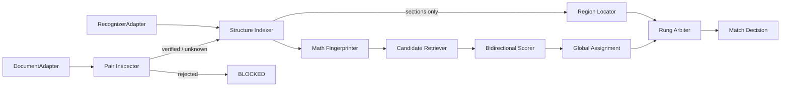

# Find-Engine v2 产品需求与架构设计

[中文](Find-Engine_v2_产品需求与架构设计_20260825.md) | [English](Find-Engine_v2_Product_Requirements_and_Architecture_20260825.md)

- 文档状态：可进入开发
- 日期：2026-08-25（第 2 版）
- 适用范围：独立匹配引擎与宿主应用集成
- 基线修改清单：[Find-Engine_修改建议清单_20260825.md](Find-Engine_修改建议清单_20260825.md)
- 证据基线：[Find-Engine_2023_2025全面测试报告_20260825.md](Find-Engine_2023_2025全面测试报告_20260825.md)

> **第 2 版改动。** 以五级决策阶梯取代"接受／拒绝"二元结果（§5A），使"拒绝作答"
> 不再等同于"拒绝提供任何帮助"。新增重构前的安全补丁阶段（阶段 0.5），把三项发布
> 阻断项放在架构改造之前而不是之后落地。`FormulaSet` 覆盖率由绝对要求改为可校准阈
> 值，并明确其对字形几何信息的依赖（FR-05）。书签快路径获得显式的保持性要求
> （NFR-05）。校准概率从决策机制降级为报告指标，直到语料规模足以支撑为止
> （FR-09），期间由分级代价阈值与分裂保形预测提供当前语料可支撑的依据
> （FR-09.1、FR-09.2）。新增 §5B 证据设计：哪些损失属于帕累托损失而非前沿取舍、
> 对文本层的共模依赖，以及针对该依赖的独立信号。指标层新增 `located_precision`、
> 风险—覆盖率曲线，以及拒绝率的"可恢复／不可消除"拆分（§12.3）。

## 1. 产品决策

### 1.1 结论

**保留现有引擎，进行"保留核心、重构编排层"的 v2 改造，不推倒重写。**

测试报告直接支持这一判断。报告中的每一项发布阻断项都是准入控制失败，而不是匹配算
法失败：2023 习题册对 2025 答案册产生的 872 条错误 `HIGH` 接受，全部来自一次在
"两本书是否配套"被追问之前就已命中的精确题号查找。相似度机制自始至终没有被调用，
不在问题范围内。

现有代码已经具备可复用资产：

- 层级题号识别与规范化；
- PDF 书签与正文索引；
- 目录单调对齐；
- 数学内容加权与运算符上下文；
- 有界序列对齐和明确拒绝结果；
- 文本质量、OCR seam、字形映射恢复；
- 现有测试与真实 PDF 语料工具。

需要替换或重构的部分集中在一条清晰的接缝上：

- 宿主直接编排多个低层函数，缺少统一的匹配会话；
- 未先验证文档角色和配套关系；
- 章节书签可能被当成题目书签；
- 引擎只有一种表达"不确定"的方式，而它什么都不返回；
- 局部分数没有经过全书级一对一分配的协调；
- 置信度只是规则标签，且没有公开任何可靠性证据；
- OCR seam 存在，但宿主路径没有提供识别器。

这些是编排与证据融合层面的问题，不构成丢弃已验证的解析与匹配实现的理由。彻底重写
会丢失来之不易的数学文本处理行为，并重新踩一遍相同的边界情况。

### 1.2 重写触发条件

只有出现以下情况之一，才重新考虑推倒重写：

1. 新的深模块接口无法在不改变半数以上可复用函数输入语义的前提下容纳现有核心。
2. 公式结构解析或全局分配在当前 JavaScript 运行时无法达到性能目标。
3. 完成 P0 工作后，固定错配矩阵仍然产生自动接受的错误答案。
4. 现有行为无法在不大量断言内部状态的情况下迁移到接口级测试。

## 2. 问题定义

输入是一本习题册和一本答案册。任意一方都可能：

- 具备题目级书签、仅有章节书签，或完全没有书签；
- 文本层可用、稀疏、损坏，或为扫描件；
- 存在重复、缺失或层级不同的题号；
- 章节、题型或单题顺序被重排；
- 缺题、多答案，或存在真正无法区分的候选；
- 属于不同年份或版本，甚至文档角色本身就是错的。

证据经常是**不对称的**。2025 配套书中，答案册书签完整、文本抽取干净（573 个题目
级书签、17,658 行），而习题册实际上是扫描件（465 页、65 行、609 个可抽取字符）。
一个要求两侧证据都强才肯工作的设计，在这本配套书上会完全失效——而它正是产品近期
的目标对象。

核心产品原则不变：

> 匹配错误比不匹配更严重。只有在严格准确率不下降的前提下才允许提升召回。

第 2 版补充一条，并将其作为承重约束：

> 拒绝**作答**不等于拒绝**帮忙**。引擎已经确定的东西——一个章节、一段页码范围、
> 一份很短的候选清单——都要以不会被误读成答案的等级返回。

## 3. 产品目标与非目标

### 3.1 目标

1. 在具备题目书签的 2023 配套书上保持 100% 准确率与召回，**并保持其当前的亚毫秒延迟**。
2. 在文档级拒绝跨年份、双答案册、双习题册、答案对习题的错误组合。
3. 区分书、章节、题型与真正的题目。
4. 在无书签条件下，通过数学结构与全局约束提升严格准确率与召回。
5. 支持重排答案册、缺题、多答案与非单调顺序。
6. 返回可解释的分级结果，既有一等公民的**拒绝权**，也有一等公民的**只定位不作答权**。
7. 保持本地优先；PDF 读取与 OCR 通过 adapter 注入。
8. 单题查询与全书建表共用同一核心。

### 3.2 非目标

- 引擎不判断数学解答是否正确。
- 生成式模型不作为必需依赖。
- 首个版本不支持所有语言、学科与编号体系。
- 点击、手动绑定等宿主交互不得掩盖引擎错误。
- 不得通过抬高分数或放宽阈值来提升置信度。
- 绝不通过降低自动接受门槛来换取覆盖率。覆盖率只能通过返回更低的等级获得，绝不
  通过提升弱证据获得。

## 4. 用户与核心场景

### 4.1 单题查询

调用方给出页面、区域或已抽取的题目，引擎返回决策阶梯中的某一级（§5A）。

### 4.2 全书建表

引擎构建完整的习题—答案映射，用于缓存、离线评测与回归测试。

### 4.3 错书与同类文档

引擎在进入逐题匹配之前阻断该配套关系，并指出矛盾所在。

### 4.4 无书签与重排答案

引擎不假设顺序一致。只有在强锚点证明顺序可靠之后，位置才会被使用。

### 4.5 扫描习题册配可读答案册

引擎无法识别题目，并明说这一点；但它仍然返回当前页对应的答案册章节页码范围——
因为答案册的结构是完好的，且与习题册的文本层完全无关。

---

## 5A. 决策阶梯

第 2 版最核心的结构性改动。此前的设计只有一种表达不确定的方式，而它什么可用信息
都不返回，于是在准确率和覆盖率之间制造了一个假的二选一。阶梯把**引擎愿意断言什么**
与**引擎实际查明了什么**分开。

| 等级 | 含义 | 呈现方式 | 是否可能犯"匹配错误"那类错？ |
|---|---|---|---|
| `AUTO_MATCH` | 唯一答案，引擎背书 | 直接显示答案 | **会**——安全工作保护的就是这一级 |
| `REVIEW` | 一份很短的候选清单，由用户选择 | 带页码的候选列表 | 否——它不做选择 |
| `LOCATED` | 未识别出题目，但已圈定答案区域 | "本节答案在第 X–Y 页" | 否——它断言范围，不断言身份 |
| `REFUSED` | 证据不足或自相矛盾 | 原因，以及补什么能解决 | 否 |
| `BLOCKED` | 配套关系无效，引擎不予处理 | 矛盾点，以及它期望的文档 | 否 |

阶梯受三条规则约束：

1. **等级是上限，不是目标。** 任何组件都不得为了改善覆盖率指标而把结果提级。
2. **低等级必须携带证据。** `REVIEW` 返回候选题号与页码；`LOCATED` 返回章节路径、
   页码范围以及产生它的对齐依据；`REFUSED` 返回原因码和缺失的输入。
3. **只有 `AUTO_MATCH` 计入严格准确率。** `REVIEW` 与 `LOCATED` 使用独立指标
   （§12.3），因此改善它们永远无法掩盖准确率的退化。

### 5A.1 配套状态决定可用等级

这是防止文档级门控退化为"一刀切拒绝"的关键。

| 配套状态 | `AUTO_MATCH` | `REVIEW` | `LOCATED` | 理由 |
|---|---|---|---|---|
| `VERIFIED_PAIR` | 允许 | 允许 | 允许 | 已由内容锚点确认身份 |
| `UNKNOWN_PAIR` | **禁止** | 允许 | 允许 | 不能背书答案，但仍可导航 |
| `REJECTED_PAIR` | 禁止 | 禁止 | 禁止 | `BLOCKED`——已发现矛盾 |

在 OCR 接入之前，2025 配套书的常态就是 `UNKNOWN_PAIR`，因此它必须是一个**可工作**
的状态。阻断它等于为了 `AUTO_MATCH` 禁令已经提供的安全性，额外注销产品在主力新书
上的全部覆盖率。

### 5A.2 阶梯挽回了什么（基于实测数据）

| 测试报告中的情形 | 当前 | 引入阶梯后 |
|---|---|---|
| 答案册无书签：872 次中拒绝 858 次 | 什么都不返回 | 用仍然可用的目录对齐，为其中绝大多数给出 `LOCATED` |
| 2025 习题册的 18 个章节书签 | 479 条错误 `HIGH` 接受 | 章节被正确归类，全书 465 页获得章节级 `LOCATED` |
| 题号重复且无章节对齐 | `NONE`，候选其实已挂在结果上 | `REVIEW`——那些候选本来就是为此准备的 |

2025 那一行值得强调：同样这 18 个书签，此前是引擎最大的错误来源，一旦归类正确就
变成它在该书上最大的安全覆盖来源。不需要任何新信号，只需要把一个已经解析出来的信
号归对类。

### 5A.3 拒绝应当发生在流程的哪一步

拒绝是**准入闸门，不是最终裁决**。角色与配套检查在建索引之前运行，代价是毫秒级，
并返回明确的原因码。把完整流程跑完再在末尾拒绝，基于三点被否决：它为一个空结果付
出了全部延迟；它算出了随后被丢弃的证据；而且一条长流水线会给引擎多次"说服自己"接
受某个匹配的机会。

排期是另一回事。识别器落在后期（阶段 6），而闸门落在前期（阶段 0.5），因此在若干
阶段内，2025 配套书会从"给出错误答案"变成"正确地拒绝 `AUTO_MATCH`"。§11.1 明确写
出这一后果，使它成为被选择的结果而不是被发现的结果。

---

## 5B. 证据设计

当新证据与已有证据**相互独立**时，准确率与覆盖率会同向提升；只有在固定证据基础上
移动阈值时，两者才彼此消长。当前的损失大多属于前者，这也是 P0 工作根本不是"平衡问
题"的原因（§5B.1）。本节规定引擎建立在什么证据之上，以及新证据如何被论证。

### 5B.1 缺陷是帕累托损失，不是前沿位置

实测到的三类失败，各自由一个根因同时造成准确率与覆盖率损失：

| 缺陷 | 准确率损失 | 覆盖率损失 |
|---|---|---|
| 章节被当作题目（FR-03） | 479 条错误 `HIGH` 接受 | 573 道真题无法被寻址 |
| 正文解析过度抽取 | 188 条无法核实的接受（严格准确率 74.3%） | 多余条目占用 top-K 名额，并把真题挤进对齐的 gap |
| 触及对齐超时（NFR-02） | 由超时产生的结果是任意的 | 本可解析的题目失去机会 |

修复每一项都同时改善两个轴，不涉及任何阈值。在这些缺陷关闭之前，不排期任何以准确
率换覆盖率的工作。

### 5B.2 共模依赖是结构性弱点

置信度模型建立在"有多少个独立信号彼此一致"之上。逐一核查真正的独立性：

| 信号 | 依赖文本层？ | 依赖两书平行？ |
|---|---|---|
| 书签题号 | 否 | 否 |
| 目录对齐 | 部分（标题文本） | 否 |
| 内容相似度 | **是** | 否 |
| 运算符上下文／公式结构 | **是** | 否 |
| 位置先验（已停用） | 否 | **是** |

五个信号里有三个经由文本层。这是共模依赖，也是扫描习题册会一次性失去几乎全部证据
基础、而不是逐步退化的原因。**价值最高的新证据，是任何不经过文本层的信号。**

### 5B.3 独立信号

每一项都必须先做原型并实测，然后才允许进入设计；不得因为"看起来合理"而采纳。

**书籍自带的印刷目录——已实现并实测。** 没有书签树的文档通常仍然印有目录，而这份
目录正是书签本该提供的"题号→位置"映射。它完全不依赖相似度，对文本层的依赖也只是两
次结构性读取。

障碍在于目录行给出的是**印刷页码**，与 PDF 页序相差一个由前置页数决定的偏移。该偏
移是被恢复出来的，而不是猜出来的：凡是同时出现在目录与正文解析中的题号，都对
`PDF 页 − 印刷页` 投一票，众数即为偏移。在 2023 答案册上实测，508 个题号中有 492
个投给 +18——96.9% 的众数，且未使用任何真值。

把该偏移直接套用到全部 508 个题号，会有 492 个正确、16 个错误。16 条自信的错误答案
不是可接受的代价，而且这个代价并不需要付：那 16 个失败恰好就是目录与正文解析彼此
不一致的题号，因此可以事先识别。只在两次独立读取一致时才输出位置，得到
**492 个位置、100% 准确率**，并使"答案册无书签"这一档从解析出 8 道题提升到 490 道，
同时每页 p95 从 204 ms 降到 1 ms——结构性短路无需任何内容比对即可定位。

这正是 §5B.2 的规则兑现：信号强，是因为它不经过相似度；信号安全，是因为两次读取不
一致时的处理方式是拒绝，而不是去打破平局。参见 `src/contents-index.js`。

**渲染公式的感知哈希（剩余价值最高的一项）。** 比较两个公式不需要读懂它们。通过现
有 PDF adapter 渲染习题侧区域与候选答案侧区域，比较图像特征。同一出版社的配套书，
同一表达式由同一排版引擎、同一字体输出，渲染结果在缩放意义下应当几乎一致。该信号
与文本层无关，不需要识别模型，**在扫描件上同样可用**，且失败方式是安全的：相似度低
即视为无证据并降级。它以远低于 OCR 的代价，攻击的正是当前完全没有信号的那一类情
形。参见阶段 3 的原型闸门（§11.3）。

**分节基数。** 若习题册第 1.2 节包含 n 道题，而答案册对齐到的小节包含 n 个条目，这
一致性就是既不涉及内容也不涉及顺序的结构证据。数量严重不符则构成反对该章节对齐本身
的证据。

**跨度长度相关性。** 长题目对应长答案。这是 Gale–Church 的长度分量，作用在跨度范围
而非序号位置上；与位置先验不同，它不假设两书平行——而这恰恰是位置先验被否决的原因
（研究报告 §7.1）。

### 5B.4 准入规则

新信号只有同时满足以下三条才被采纳：(a) 在 §5B.2 的意义上至少独立于一个现有信号；
(b) 在真实语料上有实测区分度；(c) 能够识别自身何时不适用。条件 (c) 正是位置先验没
有通过的一条，且不因某个信号"在适用场景下表现很好"而豁免。

---

## 5. 功能需求

### FR-01 文档角色识别

- 左侧文档必须是 `EXERCISE`，右侧文档必须是 `ANSWER`。
- **两侧都要检查。** 当前的单侧检查正是双答案册组合能够通过、而双习题册被拒绝只是
  出于偶然的原因。
- `UNKNOWN` 角色不得进入自动逐题匹配，但仍可到达 `LOCATED`。
- 证据包括文件名、封面标题、书签用语与正文结构。
- 调用方声明的角色是证据，不是覆盖强矛盾的许可。
- 原因码：`LEFT_ROLE_INVALID`、`RIGHT_ROLE_INVALID`。

### FR-02 配套书身份验证

- 由年份、规范化标题、学科、版次、章节结构、题号分布与抽样内容锚点构建书籍指纹。
- 年份或学科出现明确冲突，返回 `REJECTED_PAIR`。
- 证据不足返回 `UNKNOWN_PAIR`——既不是隐式放行，也不是 `BLOCKED`。参见 §5A.1。
- 唯一精确题号只有在 `VERIFIED_PAIR` 之内才算强证据。
- 字符集重叠只能说明文本可比对，不能说明两书配套。错误的 2023 习题／2025 答案组合
  重叠度仍达 0.9638；对两本中文数学书而言，这只说明它们的文本可以互相解码。

**内容锚点的定义。** 这个词承担了 FR-02 的全部重量，因此在此规定而不留给实现。抽取
同时出现在两份文档中的 k 个题号（目标 k = 24，在题号区间上分层抽样）。对每一个，用
**现有的** `contentSimilarity` 对习题侧文本与答案侧文本打分。`VERIFIED_PAIR` 要求样
本上的 top-two margin 中位数超过校准阈值。这是刻意复用已验证的机制：它是本仓库唯一
拥有实测行为的身份信号——在 2023 配套书上它把正确答案排在首位的比例为 95.5%，而字
符集检查完全无法区分这对组合。

**不对称证据。** 身份验证不得要求两侧都可读。当一侧为 `SCANNED` 或 `SPARSE_LAYER`
时，无法从该侧抽取内容锚点；此时配套关系停留在 `UNKNOWN_PAIR`，按 §5A.1 的权限工作，
而不是被阻断。OCR 接入后可从识别文本抽取锚点，配套关系可升级为 `VERIFIED_PAIR`，但
须受 FR-09 的 OCR 置信度上限约束。

- 原因码：`PAIR_IDENTITY_MISMATCH`、`PAIR_IDENTITY_UNKNOWN`。

### FR-03 结构索引

- 将每个书签节点归类为 `BOOK`、`SECTION`、`QUESTION_TYPE`、`QUESTION` 或 `UNKNOWN`。
- `1.2 一元函数微分学`、`2.7 线性变换` 这类标题必须归为 `SECTION`。在固定回归矩阵上，
  此类标题进入题目索引的数量必须为零。
- 优先使用显式标记（`例题`、`习题`、`Example`、`Exercise`、`Problem`）；当前"最深层
  级"启发式降为兜底，不再是主判据。
- 归类还使用层级、子节点数、页跨度、题号密度与序列连续性。跨越数十页的节点不可能是
  一道题。
- 只有可靠的题目级书签才能跳过正文／OCR 题目检测。
- **章节要保留，不要丢弃。** 归为 `SECTION` 的节点是 `LOCATED` 的主要输入。缺陷在于
  把章节错判成题目；把章节删掉等于放弃这项修复。
- 原因码：`NO_QUESTION_LEVEL_INDEX`——它允许 `LOCATED`，绝不触发 `BLOCKED`。

### FR-04 文本质量与 OCR

- 质量指标在现有字符类别比例之外，增加有文本页占比、每页字符数与覆盖均匀度。
- 2025 习题册（465 页、65 行、609 字符）必须判为 `SCANNED` 或 `SPARSE_LAYER`。存在
  章节书签不得成为豁免理由。
- 识别器通过 adapter 注入，可按页或按区域按需 OCR 并缓存。
- 没有识别器时，扫描输入返回 `OCR_REQUIRED` 且不产生 `AUTO_MATCH`；但仍可基于书签结构
  返回 `LOCATED`，后者完全不需要文本。
- OCR 输出与抽取文本一样要通过结构与身份门控，并带有 FR-09 的置信度上限。
- 原因码：`OCR_REQUIRED`。

### FR-05 数学结构指纹

- 保留现有的规范化、数学片段与运算符上下文。
- 增加公式结构：运算符、操作数、分组、上下标、积分／极限上下限、矩阵形状。
- 产出稳定指纹，并能解释结构差异。
- 先确定一道题的完整边界，再把边界内每一个完整数学表达式抽取为保留重数、顺序与位置
  的 `FormulaSet`。
- "完整"包含表达式的完整分组、分式、根式、上下标、积分与极限上下限、矩阵形状。截断
  或无法恢复的输出标记为 `INCOMPLETE_FORMULA`，绝不静默补全。

**覆盖率是可校准阈值，不是绝对要求。** 早期草案要求题目 `FormulaSet` 中的**每一个**
表达式都能在候选答案中找到结构兼容的对应项。这与本语料已记录的性质相反：答案条目常
常只给结果，因此一道含三个表达式、而答案一个都没有复述的题目会直接被卡死。对一个规
模不固定的集合施加合取式要求，会在引擎最需要服务的场景上把召回压到零。因此要求改为：

- `AUTO_MATCH` 要求 `FormulaSet` 覆盖率达到校准阈值 θ **且**不存在强结构冲突。θ 按
  FR-09 拟合并公开，初值取 1.0，只能依据实测准确率逐步放宽。
- **强结构冲突**——两个本应对应的表达式之间指数、符号、积分或极限上下限、矩阵元不一致
  ——无论覆盖率多高，一律封顶到 `REVIEW`。冲突证据比缺失证据更严重。
- 抽取不完整封顶到 `REVIEW` 或 `REFUSED`，绝不产生猜测式补全。
- 运算符局部字符上下文只作为次级消歧：在完整表达式匹配之后才被查阅，不能独立触发匹配，
  也不能提升存在缺失、截断或冲突公式的候选。**窗口半径是校准参数，不是固定需求**——
  当前取值 3 是针对现有字符表征扫出来的，FR-05 替换该表征后必须重扫。

**Adapter 依赖，明确写出。** 上标、下标、分数线与矩阵版式都是**几何**事实。当前的
`DocumentAdapter` 只返回 `{page, text}` 行并丢弃位置，因此 FR-05 无法在其之上实现。
阶段 3 开工前必须二选一并记录在案：

- **(a)** 扩展 `DocumentAdapter` 暴露带位置的字形串——这会改变语料格式、
  `tools/extract-corpus.mjs` 以及全部已存 fixture；或
- **(b)** 把 FR-05 收缩到线性文本可恢复的结构——括号深度、运算符序列、片段重数——并接受
  更小的结构词汇表。

从能力角度更倾向 (a)，其成本也更高。该决定是阶段 3 的准入闸门，不是实现细节。

### FR-06 候选检索

- 为题号、章节、公式结构与关键词建立倒排索引。
- 为每道题生成有界的 top-K 候选集。
- 不得仅因顺序不同就丢弃内容强匹配的候选。
- 证据不足或矛盾时返回空集——已知区域时转入 `LOCATED`，无区域时转入 `REFUSED`。

### FR-07 双向一致性

- 若习题 A 选中答案 B，需验证答案 B 也选中习题 A。
- 互为最优可增强证据。
- 单向匹配且反向冲突不得进入 `AUTO_MATCH`，封顶到 `REVIEW`。

### FR-08 全局一对一分配

**适用范围。** 本需求只约束 `matchAll`。`matchQuestion` 不存在需要求解的全局问题，
以下保证不适用。任何依赖全局分配的结论都必须写明它在哪种模式下成立。

- 一个答案最多分配给一道题，计量单位是**唯一题目**而非页。跨页题目在其覆盖的每一页
  被接受，算一次分配而不是多次（§12.3）。
- 缺题与未被使用的答案都是合法结果。
- 支持重排答案册。
- 由强锚点估计顺序可靠度；只有可靠时才把顺序作为软分数，不可靠时关闭硬位置约束。
- 高置信分配可提交；较低置信的分配保持可回滚。
- 不得从不可变索引中删除记录；用分配表与可用性掩码管理状态。

**求解器与性能边界。** 带 gap 代价的矩形分配，在稀疏 top-K 候选图上用匈牙利算法的
Jonker–Volgenant 变体求解，而非稠密矩阵。573 道题、K = 16 时图约有 9×10³ 条边。目标：
全书分配在桌面端 3 s 内、目标平板 15 s 内完成，需实测；任一边界不达标则以分节切分兜底。

### FR-09 置信度与拒绝

- 返回 §5A 的某一等级，并附序数置信档。
- 证据包括 top-two margin、双向一致性、分配替换代价、`FormulaSet` 覆盖率与扰动稳定性。
- 强冲突封顶等级。配套身份未知、结构未知或文本来自 OCR 均施加硬上限。
- `LOW` 档绝不作为最终答案展示，它是 `REVIEW` 候选。

**校准目前是被报告的，不是承重的。** 拟合 0..1 概率需要按书切分（§10.2），而当前语料
只有一对完整配套书，外加一对习题侧为扫描件的半配套。用一本书训练、一本书评估拟合出
的概率是一条穿过噪声的曲线；把它上线会重演位置先验负结果所记录的失败：一个信号呈现
出超过其证据基础的确定性。因此：

- **决策机制**仍是由"有多少独立信号一致"导出的序数档——正是它当前产生零错误匹配。
- 自阶段 5 起计算并公开**可靠性曲线**（每档的实测正确率），作为报告指标。
- 只有当至少**六**对独立配套书可用于切分训练、校准与盲测时，校准阈值才取代序数档。
  在此之前，§13 P1 的置信度门槛由可靠性曲线满足，而非由拟合概率满足。

#### FR-09.1 每个等级一个阈值，由该等级的代价导出

引擎没有单一工作点，而是每个等级一个，因为在各等级上"犯错"的代价并不相同。按经典的
拒识结果，当一个错误答案的代价是一次弃答的 C 倍时，接受条件为
`P(正确) > 1 − 1/C`。

| 等级 | 出错时用户付出的代价 | 工作取值 C | 对应阈值 |
|---|---|---|---|
| `AUTO_MATCH` | 相信了错误解答，后续工作全部自信地错下去 | ~100 | ~0.99 |
| `REVIEW` | 扫一遍短清单、没找到、退回 | ~10 | ~0.90 |
| `LOCATED` | 翻到错误的小节，多翻几页 | ~3 | ~0.67 |

C 是产品输入，不是工程常数。每个取值都必须连同设定人一起记录，并在宿主 UI 改变某一
等级的呈现方式时重新审视。此表的意义在于结构：**一套分数、多个阈值，每个都由一条写
明的代价论证**，而不是把单一全局阈值套用到异质证据上。

#### FR-09.2 用分裂保形预测给出集合式决策

分裂保形预测提供一个与分布无关的保证——真值以不低于 1 − α 的概率落在返回的候选集合中
——所需校准集规模约为一百个样本，而不是六本书。因此，在 FR-09 的拟合概率路径仍被阻塞
期间，它为决策阶梯提供了当前语料确实能支撑的依据。

- 由融合证据为每个候选计算 nonconformity 分数。
- 在一本未用于设定任何其他阈值的书的**习题侧**题目留出集上校准分位数。
- 输出预测集合并映射到等级：大小为 1 → `AUTO_MATCH`；2–5 → `REVIEW`；更大但区域有界
  → `LOCATED`；无界 → `REFUSED`。
- α 由所授权等级的 §FR-09.1 代价比确定。

**已写明的局限。** 保形保证是**边际的**——在校准分布上取平均——而不是对单道题条件成立，
且它依赖可交换性，换出版社或换排版体例都会破坏该假设。它是关于所校准语料的保证。采
纳它是因为它比未校准的阈值有更扎实的依据，且退化方式是可见而非静默的，而不是因为它
无条件成立。

### FR-10 稳定性检查

- 在替换规范化方式、更换 OCR 候选、施加小幅输入扰动的条件下重跑决策。
- 稳定的候选可以保住其等级；不因"稳定"单独提级。
- 在小扰动下改变的候选降到 `REVIEW` 或 `REFUSED`。

### FR-11 可诊断结果

- 返回标准集合内的语义原因码：`LEFT_ROLE_INVALID`、`RIGHT_ROLE_INVALID`、
  `PAIR_IDENTITY_MISMATCH`、`PAIR_IDENTITY_UNKNOWN`、`OCR_REQUIRED`、
  `NO_QUESTION_LEVEL_INDEX`、`INCOMPLETE_FORMULA`、`STRUCTURAL_CONFLICT`、
  `AMBIGUOUS_LABEL`、`REVERSE_CONFLICT`、`TIMEOUT`。
- 只返回诊断该结果所需的证据与候选位置摘要。
- 不记录完整的受版权保护题面。
- 相同输入、相同引擎版本与配置必须产生确定性结果。

## 6. 非功能需求

### NFR-01 安全

- 固定错配矩阵中 `AUTO_MATCH` 数量必须为零。
- 无法核实的接受结果计入严格准确率的分母之外、算作错误（§12.3）。
- 超时、取消与 adapter 失败必须 fail closed——降到 `REFUSED`，或在失败前已确定区域时
  降到 `LOCATED`。

### NFR-02 性能

- 每份文档只建一次索引并缓存。
- 单题只与稀疏 top-K 候选比对，不与整本答案册比对。
- 桌面端单题 p95 目标：低于 150 ms，不含首次 OCR。
- **超时不得成为承重结构。** 当前"习题册无书签"一档出现 1,534.6 ms 的最大值，而对齐
  截止时间约为 1,500 ms，这意味着该档的结果是由到期产生的，而不是由判断产生的。阶段 3
  之后，任何一档的最大值都不得进入截止时间的 20% 区间内，且超时次数是公开指标。
- 全书分配性能边界见 FR-08。
- 内存中保持不可变索引与小型分配表；不得复制完整正文文本。

### NFR-03 隐私与离线

- 默认不需要网络。
- PDF、OCR 输出、题面文本与书籍指纹全部留在本地。
- 任何可选的远程 adapter 必须由宿主显式启用。

### NFR-04 可测试性

- 调用方与测试使用同一外部 seam。
- 行为测试断言决策与证据，不断言内部数组或算法步骤。
- 生产 PDF adapter、语料 adapter 与识别器 fake 满足同一接口。
- **纯函数单元测试是永久性的。** `normalizeForMatch`、`normalizeId`、`compareIds`、
  `symbolContexts`、`assessTextQuality` 与字形学习器保留各自的直接测试。它们成本低，
  且能定位接口级测试只能"发现"而无法定位的回归；§12.1 的删除策略不适用于它们。

### NFR-05 快路径保持性

2023 有书签配置当前以 p95 0.017 ms 解析 508/508，因为唯一精确题号在任何相似度计算之前
就已短路返回。FR-07、FR-08、FR-10 若不加约束，都会在这条路径上增加工作量。

- 在 `VERIFIED_PAIR` 之内，唯一精确题号且无反向冲突时短路返回 `AUTO_MATCH`，不经过候选
  检索、全局分配与扰动检查。
- 锁定 2023 有书签基线：508/508 唯一召回、100% 严格准确率、**p95 低于 1 ms**，自阶段 0
  起作为回归测试强制执行。
- 任何使该 p95 超过 1 ms 的阶段即为回归，不得通过出口条件。

---

## 7. 目标架构

### 7.1 外部深模块

建立单一 `MatchingEngine` 深模块。对外接口保持很小，而文档验证、结构解析、指纹、检索、
分配与校准全部留在实现内部。

```js
const prepared = await MatchingEngine.preparePair({
  exerciseDocument,
  answerDocument,
  recognizer,
  options,
});

// BLOCKED 到此为止；UNKNOWN 继续，但 AUTO_MATCH 被禁用。
if (prepared.status === 'REJECTED_PAIR') return prepared.rejection;

const decision = await prepared.session.matchQuestion(target);
const bookResult = await prepared.session.matchAll();
```

外部接口：

```text
preparePair(input) -> PairPrepared | PairRejected
PairSession.matchQuestion(target) -> MatchDecision
PairSession.matchAll(options?) -> BookMatchResult
```

`PairPrepared` 携带 `pairStatus` 及由此产生的等级权限（§5A.1），使宿主无需窥探内部即可
渲染正确的交互。接口不暴露阶段、权重、动态规划矩阵或缓存形状。

### 7.2 Adapter seam

把现有文档契约正式化为 `DocumentAdapter`：

- 生产 adapter：pdf.js 文档；
- 测试 adapter：内存中的版权语料记录。

定义 `RecognizerAdapter`：

- 生产 adapter：本地 OCR；
- 测试 adapter：确定性 fake／OCR fixture。

两个 seam 都有至少两个有正当理由的 adapter。公式解析、候选检索、分配与校准保持为内部
seam，不作为公开接口。**`DocumentAdapter` 的形状取决于 FR-05 的决定**——若采纳方案 (a)，
它必须暴露带位置的字形串，语料格式随之改变。

### 7.3 内部模块



- **Pair Inspector**：角色、年份、标题、章节与内容锚点。输出 `pairStatus` 与等级权限。
- **Structure Indexer**：章节／题型／题目归类、质量评估与 OCR 调度。
- **Region Locator**：把章节归类与目录对齐转成有界答案区域。这是 `LOCATED` 的路径，且
  不依赖文本层。
- **Math Fingerprinter**：现有字符信号加公式结构。
- **Candidate Retriever**：倒排索引与稀疏 top-K 候选。
- **Bidirectional Scorer**：正反向匹配与证据融合。
- **Global Assignment**：一对一映射、gap、重排与可回滚状态。仅 `matchAll`。
- **Rung Arbiter**：施加上限与权限，产出最终等级。这是全系统唯一决定等级的地方。
- **Match Decision**：稳定、可解释、可拒绝的对外结果。

## 8. 核心数据契约

### 8.1 PairDecision

```text
status: VERIFIED_PAIR | UNKNOWN_PAIR | REJECTED_PAIR
exerciseRole: EXERCISE | ANSWER | UNKNOWN
answerRole: EXERCISE | ANSWER | UNKNOWN
permittedRungs: ('AUTO_MATCH' | 'REVIEW' | 'LOCATED')[]
reasonCodes: string[]
evidenceSummary: object
```

### 8.2 QuestionRecord / AnswerRecord

```text
id: 稳定的内部 id
label: 规范化层级题号 | null
kind: SECTION | QUESTION_TYPE | QUESTION | UNKNOWN
pageRange: [from, to]
sectionPath: string[]
textFingerprint: object
mathFingerprint: object
source: OUTLINE | TEXT | OCR
quality: object
```

### 8.3 MatchDecision

```text
status: AUTO_MATCH | REVIEW | LOCATED | REFUSED | BLOCKED
band: HIGH | MEDIUM | LOW | NONE
reliability: 该档的实测正确率 | null
answerLocation: page/range | null
region: { sectionPath, from, to } | null      // LOCATED 时填充
cappedBy: 原因码 | null                        // 为何没有更高等级
reasonCodes: string[]
evidence: {
  pairVerified,
  labelAgreement,
  formulaCoverage,
  structuralConflicts,
  operatorContextSimilarity,
  bidirectionalAgreement,
  assignmentStability,
  topTwoMargin
}
candidates: 诊断用摘要[]
```

只要等级低于 `AUTO_MATCH`，`cappedBy` 必填。一个说不出自己为何被封顶的结果，就是一个
没有记录推理过程的结果。

## 9. 算法流程

1. **准入或阻断。** `preparePair` 验证两侧文档角色，再由标题、年份、版次、学科、书签结构
   与抽样内容锚点验证配套身份。出现矛盾立即返回 `BLOCKED`，且在任何索引之前。证据不足返回
   `UNKNOWN_PAIR`，撤销 `AUTO_MATCH` 但会话继续。
2. 构建唯一且不可变的答案册索引，区分章节与真正的答案。按需通过识别器 OCR 页面或区域并缓存。
3. **先确定区域。** 由章节归类与目录对齐圈定当前页对应的答案区域。这不需要文本、不需要相似度，
   并且是后续所有步骤的底线：若之后一切失败，结果是 `LOCATED` 而不是什么都没有。
4. 单题模式下，由用户点击或显式题号确定题目边界，只读取该区域；全书模式下从第一题开始处理，
   不做不可回滚的贪心提交。
5. **快路径。** 在 `VERIFIED_PAIR` 之内，唯一精确题号且无反向冲突时在此返回 `AUTO_MATCH`
   （NFR-05），第 6–12 步不执行。
6. 抽取题号、章节、关键词，以及当前题目内每一个完整数学表达式，构成有序 `FormulaSet`。
   边界不完整或来自 OCR 的内容标记为显式风险。
7. 在生成有界 top-K 候选集之前，先施加角色、配套身份、题号、章节与倒排索引过滤。不得仅因
   答案顺序不同就丢弃内容强候选。
8. 要求 `FormulaSet` 覆盖率达到 θ 且无强结构冲突；只有在此之后才查阅运算符局部上下文作为次级消歧。
9. 对习题→答案与答案→习题双向打分。反向冲突封顶到 `REVIEW`。
10. 由高置信锚点估计顺序可靠度。可靠时用局部窗口提速，不可靠时关闭硬位置约束。
11. 仅 `matchAll`：求解允许 gap、缺题、多答案与重排的全局一对一分配。高置信分配进入 occupied
    集合，其余保持临时且可回滚。绝不从源索引删除记录。
12. 对候选、公式解析与 OCR 输出运行扰动稳定性检查。
13. **裁定等级。** 施加配套权限（§5A.1）与全部上限，记录 `cappedBy` 并返回。公式不完整、证据
    冲突、top-two margin 不足或配套身份未知都不能产生 `AUTO_MATCH`——但只要第 3 步已确定区域，
    它们返回 `LOCATED`，而不是什么都不返回。

## 10. 置信度设计

### 10.1 原则

- 原始相似度不是概率。
- 只有独立证据一致时置信度才上升。
- 冲突证据比缺失证据更严重。
- 配套身份未知、结构未知或文本来自 OCR 施加硬上限。
- 阈值来自留出书目，而不只是当前语料。
- 无法在留出书目上验证的置信度机制，不得作为决策机制上线（FR-09）。

### 10.2 校准数据

正例是已验证的题目—答案对。

难负例包括：

- 不同年份的相同题号；
- **同出版社、同学科、相邻版次的近似配套书**——近似错配情形，也是 FR-02 真正会被检验的地方；
- 同一小节内的不同题目；
- 仅在指数、符号、上下限或矩阵元上不同的公式；
- 双答案册、双习题册与答案对习题的组合；
- 与题号冲突的章节编号；
- 重排、缺失与多余条目；
- OCR 替换、缺字、断行与公式变体。

训练、校准与盲测**按书切分**，绝不按同一本书内随机抽题切分。当前语料尚不足以支撑所需宽度；
过渡期上线什么、以及什么条件解锁变更，见 FR-09。

## 11. 开发阶段

### 11.0 阶段 0：冻结证据基线

- 保留全部现有测试。
- 冻结测试报告中的 2023/2025 全书测量结果。
- 为跨年份、双答案册、双习题册与章节误判补充红测。
- 将 NFR-05 快路径基线锁为回归测试。
- 报告严格准确率、唯一召回、拒绝率、`LOCATED` 率与性能。

出口条件：每个已知缺陷都能稳定复现，且新测试先失败。

### 11.05 阶段 0.5：安全补丁——在重构之前

三项发布阻断项今天就在线上，而且没有一项需要新架构。角色检查是对两份文档的一个谓词；身份
检查是指纹比对加一次内容锚点抽样；稀疏层检查是现有质量门里的一个阈值。把它们压在整仓重构之
后，等于让 872 条错误 `HIGH` 接受在阶段 1 的整个周期里继续留在线上。

- 在现有宿主入口处做双侧角色门控。
- 配套身份 `VERIFIED` / `UNKNOWN` / `REJECTED`，在 `VERIFIED` 之外阻断 `HIGH`。
- 稀疏层检测返回 `OCR_REQUIRED`。
- 书签节点的章节／题目归类。

出口条件：固定错配矩阵 accepted = 0 且 `HIGH` = 0；2025 无 OCR 时 accepted = 0；2023 有书签
基线不变。这是可在当前架构上交付的增量，并且预期会把 2025 的覆盖率降到接近零——阶段 2 随后用
`LOCATED` 把它补回来。

### 11.1 阶段 1：建立 MatchingEngine 外部 seam

- 增加 `preparePair`、`matchQuestion`、`matchAll`。
- 把现有文档接口包进 adapter。
- 在改变任何结果之前，先把现有行为（含阶段 0.5 的门控）移到深模块之后。
- 宿主只调用新接口。

出口条件：全部现有测试通过；阶段 0.5 的矩阵结果不变；宿主不再编排低层匹配函数。

**明确写出的产品后果。** 从阶段 0.5 到阶段 6 识别器落地之间，2025 配套书由"正确拒绝"支撑，
并自阶段 2 起获得章节级 `LOCATED` 导航；在该窗口内它没有 `AUTO_MATCH` 覆盖。相对于今天的错误
答案，这是安全性的真实提升，同时也是表面覆盖率的真实下降。这是被选择的，不是被发现的。

### 11.2 阶段 2：等级阶梯与区域定位

- 实现五级阶梯与 Rung Arbiter。
- 基于章节归类与目录对齐实现 Region Locator。
- 把此前返回空的拒绝，在证据允许时改道到 `LOCATED` 与 `REVIEW`。
- 宿主对各等级做可区分的渲染。

出口条件：在"答案册无书签"一档，`LOCATED` 覆盖此前 858 条空拒绝中的大多数，且 `AUTO_MATCH`
无回归；2025 在其页码范围内给出章节级 `LOCATED`，错误答案为零。

### 11.3 阶段 3：数学结构指纹与稀疏检索

- **先跑原型闸门：** 在承诺 adapter 改造之前，先在真实语料上实测渲染公式感知哈希（§5B.3）。
  报告正确候选与最优错误候选之间的区分度，以及扫描侧配套书上的区分度。若该信号成立，本阶段
  要建的东西就会改变——它以显著更低的代价，提供了公式结构解析本打算提供的、与文本层无关的证据。
- **准入闸门：** 结合原型结果做出并记录 FR-05 的 adapter 决定——(a) 带位置字形串，或
  (b) 收缩结构词汇表。
- 公式结构表征；现有运算符上下文作为兼容特性保留。
- 倒排索引与 top-K 候选。
- 可解释的结构差异。

出口条件：难公式负例上无新增自动错误；单题 p95 达标；任何一档的最大延迟都不落在截止时间的
20% 区间内；无论成败，原型结果都被记录。

### 11.4 阶段 4：双向一致性与全局分配

- 互为最优检查。
- 允许 gap 与重排的一对一映射，按唯一题目计量。
- 已提交／临时／可回滚状态。
- 自适应顺序可靠度。

出口条件：重排、缺题、多答案测试通过；一个答案绝不被自动分配两次；NFR-05 快路径 p95 不变。

### 11.5 阶段 5：可靠性证据与稳定性

- 在语料允许的范围内建立按书切分。
- 公开每个序数档的可靠性曲线。
- 增加输入扰动检查。
- 由实测可靠性设定等级阈值。

出口条件：每个序数档都有公开的实测正确率；全部固定难负例被拒绝。校准概率只在达到 FR-09 所述
语料宽度时才取代序数档。

### 11.6 阶段 6：宿主接入与灰度

- 生产 OCR adapter。
- 缓存与取消。
- v2 以只读影子模式对照 v1 运行。
- 验收通过后再切换，并保留快速回滚开关。

出口条件：设备测试验证的是集成与性能，而不是核心正确性。

## 12. 测试策略

### 12.1 接口级测试

新测试跨 `MatchingEngine` 外部 seam，断言：

- 配套判定与可用等级；
- 匹配判定、等级与 `cappedBy`；
- 全书分配；
- 语义原因码；
- 性能与取消。

只有在同一行为已被深接口完整覆盖之后，才删除旧的浅模块测试——**不包括**受 NFR-04 保护的
纯函数测试，那些是永久性的。

### 12.2 固定回归矩阵

- 2023 Q→A 的四种书签组合。
- 2025 Q→A 的四种书签组合。
- Q23→A25 与 Q25→A23。
- A23→A23、A25→A25、A23→A25、A25→A23。
- 全部 Q/Q 与 A/Q 组合。
- **近似错配对：** 同出版社、同学科、相邻版次、题号空间重叠。若无现成书目，可通过扰动指纹合成。
  这才是 FR-02 真正会被检验的地方；2023 对 2025 相比之下过于容易。
- 相同、局部重排与完全重排的答案册。
- 缺题、多答案与重复题号。
- 扫描输入：无 OCR、有 OCR、有 OCR 噪声。
- **不做页面抽样。** 无书签各档在完整书目上运行；现有套件中每 8 页／每 16 页的抽样予以退役。

### 12.3 指标

**决策单位。** 指标以**唯一题目**计量，而非以页计量。当前"508 道题产生 872 条接受"是把跨页
题目在其覆盖的每一页各计一次，这不是用户面对的事件，并且同时抬高了分子与分母。按页计数保留
为诊断信息。

- `strict_precision = 已核实正确的 AUTO_MATCH / AUTO_MATCH 总数`——只统计 `AUTO_MATCH`；
- `unique_recall = 不同的正确题目数 / 金标题目数`；
- `located_coverage = 获得有界区域的题目数 / 金标题目数`；
- `located_precision = 包含真实答案的区域数 / 返回的区域数`；
- `review_hit_rate = 候选集合含真值的 REVIEW 数 / REVIEW 总数`；
- 文档拒绝率；
- 错误 `AUTO_MATCH` 的数量；
- p50、p95、max 与**超时次数**；
- 每个序数档的可靠性，以及 top-two margin 分布。

`located_coverage` 与 `review_hit_rate` 是覆盖率指标，与严格准确率并列报告，绝不并入其中。
`located_precision` 与它们一同报告：不包含答案的区域是真实错误，只是比错误的 `AUTO_MATCH`
更廉价；一个错误率未被测量的等级，就是一个必然漂移的等级。

#### 12.3.1 风险—覆盖率，而不是单点

单一准确率数值是一条曲线上的一个点，而曲线形状由阈值选定，因此可以在引擎毫无改进的情况下通过
移动阈值来"改善"。除点指标外，公开**风险—覆盖率曲线**及其面积（AURC）。AURC 与阈值无关，因此
它度量的是真正被工程化的性质——引擎对自己知道什么这件事有多清楚——并且无法通过重调阈值来粉饰。

#### 12.3.2 把拒绝率拆成可恢复与不可消除

引擎目前无法区分"因证据太弱而拒绝"与"因题目本身确实无法区分而拒绝"，而这两者需要相反的应对。
书签金标已经可以把它们分开：

- 对每一次拒绝，询问金标是否存在唯一正确答案。
- 若存在，该次拒绝是**可恢复的**——它计在引擎账上，是提升空间。
- 若不存在（题号重复且内容无法区分），该次拒绝是**不可消除的**——它是正确的，任何工程手段都
  无法消除。

按档报告 `recoverable_refusals` 与 `irreducible_refusals`。没有这一拆分，"提升覆盖率"就没有分母，
也无法设定目标。这是目标 4 下任何工作的前置条件，不是可选的诊断。

## 13. 发布门槛

### P0：全部必须满足

- 全部现有测试通过。
- 2023 有书签保持 508/508、100% 严格准确率、**p95 低于 1 ms**（NFR-05）。
- 固定矩阵上每个跨书错配组合 accepted = 0 且 `AUTO_MATCH` = 0。
- 每个双答案册、双习题册与答案对习题组合在文档级被阻断。
- 2025 无 OCR 时返回 `OCR_REQUIRED` 且 `AUTO_MATCH` = 0。
- 固定矩阵上进入题目索引的章节标题数为零。
- 超时与取消绝不产生 `AUTO_MATCH`。

### P1：默认启用前必须满足

- 盲测书目上的 `AUTO_MATCH` 严格准确率达到产品风险目标。
- 所有无书签各档分别公开严格准确率、唯一召回、`located_coverage` 与 `review_hit_rate`。
- 重排、缺题与多答案绝不产生重复的自动分配。
- 桌面端单题 p95 低于 150 ms（不含首次 OCR）；任何一档的最大值不落在截止时间的 20% 区间内。
- 每个序数置信档都有来自未参与阈值选择的书目的实测正确率。

## 14. 风险与控制

| 风险 | 控制 |
|---|---|
| 公式结构定义过宽 | 先支持当前教材文法；未知语法退回字符指纹并降级 |
| FR-05 暗中要求新的 adapter 契约 | 已列为阶段 3 准入闸门，并给出两个计过成本的方案（FR-05） |
| 全局分配过慢 | 稀疏 top-K 候选、分节切分、已提交锚点，以及实测的平板端边界（FR-08） |
| 过拟合单一年份 | 按书切分；纳入跨年份与近似错配难负例 |
| 把 OCR 质量误当作内容证据 | OCR 置信度上限、扰动稳定性、fail-closed |
| 新架构使书签快路径退化 | NFR-05 以 p95 回归测试锁定，自阶段 0 起强制执行 |
| 置信度看起来好但并不诚实 | 六对配套书之前序数档保持为决策机制；公开可靠性而非宣称可靠性 |
| 安全工作被重构拖后 | 阶段 0.5 在当前架构上先行交付门控 |
| 门控退化为一刀切拒绝 | 等级阶梯与 §5A.1 权限；`located_coverage` 作为发布跟踪指标 |

## 15. 开发清单

### 保留

- 层级题号规范化；
- 基础文本质量指标；
- OCR seam 与缓存方式；
- 数学片段、运算符上下文与内容相似度；
- 目录单调对齐——现在同时是 `LOCATED` 的引擎；
- 有界序列对齐与拒绝结果表示；
- 字形映射恢复；
- 语料抽取工具、现有测试，以及 NFR-04 点名的纯函数单元测试。

### 重构

- 把编排从宿主移入 `MatchingEngine`。
- 用显式结构归类取代书签切分，并保留章节作为定位锚点。
- 把精确题号相等从结论改为已验证配套书内的强证据，同时保留其快路径（NFR-05）。
- 用全书分配表取代页内归属，按唯一题目计量。
- 用五级阶梯取代接受／拒绝二元结果。
- 保留 HIGH/MEDIUM/LOW 作为序数档；补充公开的可靠性，而不是拟合概率。

### 新增

- Pair Inspector，含内容锚点抽样；
- Structure Classifier；
- **Region Locator**；
- **Rung Arbiter**；
- Formula Structure Fingerprinter；
- Sparse Candidate Retriever；
- Bidirectional Scorer；
- Global Assignment Solver；
- 可靠性报告；
- `MatchingEngine` seam 及生产／测试 adapter。

## 16. 与原修改清单的关系

原测试导出的修改清单仍然是缺陷基线：什么失败了、什么必须先修、需要哪些验收证据。本文档定义目标
产品、架构、实施顺序与发布策略。

第 2 版在四处刻意偏离该清单：

| 清单条目 | 第 2 版 | 原因 |
|---|---|---|
| `AUTO_MATCH` 要求 100% `FormulaSet` 覆盖 | 覆盖率 ≥ θ，可校准，初值 1.0 | 答案条目常常只给结果；对规模不固定的集合施加合取式门槛会把召回压到零 |
| 固定的左右三字符上下文 | 运算符局部上下文，半径可校准 | 取值 3 是针对现有字符表征扫出来的，而 FR-05 会替换该表征 |
| 置信度改为校准概率 | 序数档加公开可靠性 | 一对完整配套书无法支撑按书切分 |
| 拒绝／接受 | 五级阶梯 | 二元拒绝丢弃了可挽回的覆盖率——实测一档中有 858 条空拒绝 |

开发过程中两份文档并用：

1. [Find-Engine_修改建议清单_20260825.md](Find-Engine_修改建议清单_20260825.md)：P0/P1/P2 缺陷与门槛。
2. 本文档：产品需求、深模块接口、目标架构、迁移阶段与灰度策略。
